# Safe AI Service Roadmap (SRM) 및 To-Do 리스트

이 문서는 **Safe AI** 제품의 발전 단계를 전략적 중요도와 실행 순서에 맞춰 재구성하고, 각 단계별 구체적인 실행 계획(To-Do)을 정리한 로드맵입니다.
기존 모델 통제(DLP) 영역을 넘어 비용 최적화(FinOps), 데이터 비식별화, 포렌식/감사, 그리고 폐쇄망(하이브리드) 지원 등 엔터프라이즈 시장의 필수 요구사항을 모두 통합적으로 반영하였습니다.

> 💡 **참고:** 본 로드맵의 각 단계(Phase)별 구체적 9개월 개발 일정 및 투입 자원, 추진 To-Do 리스트는 [12. 가설적_일정표_WBS.md](file:///C:/AG_Project/Safe%20AI%20MVP/01_%EA%B8%B0%ED%9A%8D_%EB%B0%8F_%EB%AA%A9%ED%91%9C/12.%20%EA%B0%80%EC%84%A4%EC%A0%81_%EC%9D%BC%EC%A0%95%ED%91%9C_WBS.md) 문서를 기준 삼아 진행됩니다.

## 📊 로드맵 시각화 (Flowchart)

```mermaid
flowchart LR
    %% Define Styles
    classDef priority1 fill:#ffebee,stroke:#c62828,stroke-width:2px,color:#b71c1c,font-weight:bold
    classDef priority2 fill:#e8eaf6,stroke:#283593,stroke-width:2px,color:#1a237e,font-weight:bold
    classDef priority3 fill:#e8f5e9,stroke:#2e7d32,stroke-width:2px,color:#1b5e20,font-weight:bold
    classDef priority4 fill:#fff8e1,stroke:#f9a825,stroke-width:2px,color:#f57f17,font-weight:bold
    classDef priority5 fill:#e0f2f1,stroke:#00695c,stroke-width:2px,color:#004d40,font-weight:bold
    classDef priority6 fill:#f3e5f5,stroke:#6a1b9a,stroke-width:2px,color:#4a148c,font-weight:bold
    classDef priority7 fill:#e0f7fa,stroke:#00838f,stroke-width:2px,color:#006064,font-weight:bold

    %% Nodes (Unified Boxes to prevent shifting)
    A["🏆 1순위: 1개사 Pilot (MVP 구현)\n-----------------------\n• 통합 Admin/User 포털\n• 기초 DLP 마스킹 (단일 테넌트)\n• 단일 SSO & 단일 SIEM 연동\n• API Key/사용량 기본 통제"]:::priority1
    B["🥈 2순위: N개사 Pilot & FinOps (SaaS)\n-----------------------\n• 멀티테넌트 DB 격리\n• K8s 오토스케일링\n• 다중 SSO/SIEM 파이프라인\n• 캐싱 & 라우팅 (FinOps)"]:::priority2
    C["🥉 3순위: 신규 위협 통제 고도화\n-----------------------\n• 웹 브라우저 통제 연동\n• MCP 접근 제어 모듈\n• A2A 네트워크 모니터링"]:::priority3
    D["🏅 4순위: 엔터프라이즈 API 확장\n-----------------------\n• 결재망 연동 Webhook/API\n• Plug-in 기반 아키텍처 제공"]:::priority4
    E["🛡️ 5순위: 표준 감사 로깅 프로비저닝\n-----------------------\n• SIEM 연동 (Syslog/JSON)\n• 포렌식 Raw Data Export\n• SI 작업 최소화 및 표준화"]:::priority5
    F["🎖️ 6순위: AI-SPM (거버넌스 진화)\n-----------------------\n• 섀도우 AI 자산 식별\n• 컴플라이언스 형상 진단\n• Lifecycle 리스크 모니터링"]:::priority6
    G["🚀 7순위: [R&D 심의] 차세대 코어\n-----------------------\n• Gemma 로컬 sLLM 지능형 DLP\n• 동형암호 연산 타당성 검토"]:::priority7

    %% Edges
    A --> B --> C --> D --> E --> F --> G
```

---

## 📋 요약 표 (Summary Table)

| 구분 | 구현완료 | 5월 자체개발(TBD) | 투심범위 | 투심범위 | TBD | 추후 진행 | 별도 심의 |
|:---:|---|---|---|---|---|---|---|
| **단계** | 1개사 Pilot (MVP 구현) | N개사 Pilot & FinOps (멀티테넌트 SaaS/다중 연동) | 신규 위협 통제 고도화 (웹/MCP 등 확장) | 엔터프라이즈 API 확장 (개방형/표준화) | 표준 감사 데이터 프로비저닝 (SI 연동 최소화) | AI-SPM (거버넌스 플랫폼) | [R&D 심의] 차세대 AI 보안 |
| **핵심 목표** | 기초 마스킹, 포털, 단일 커넥터를 탑재한 MVP로 5월 중 1개사 레퍼런스 검증 | 복수 기업(N개사) 수용을 위한 탄력적인 SaaS 인프라 구축, 다중 IdP/SIEM 지원 및 비용 최적화 | 섀도우 AI 통제 영역 확장 및 새로운 LLM 위협 벡터에 대한 선제 방어 | SI성 구축을 지양하고 Open API/Webhook을 제공하여 고객 주도적 연동(결재망 등) 생태계 확보 | 맞춤형 리포트 제작(SI)을 배제하고, 범용 SIEM 포맷 및 Raw Data Export 제공에 집중 | 전체 AI 자산과 흐름을 통합 모니터링하는 현황 관리 진화 | 당장 상용화가 어려운 고급 기술들(지능형 엔진, 동형암호 등)을 장기 연구로 보류 |
| **핵심 과제 (To-Do)** | • **Admin/User 포털 구축** • **기초 탐지 및 한도 통제** • **단일 SSO 및 SIEM 연동** • **1개사 파일럿 (MVP)** | • **멀티테넌트 아키텍처 전환** • **다중 SSO/SIEM 인프라 확장** • **캐싱/폴백(AI FinOps)** • **오토스케일링(K8s) 적용** | • **사무직 대상 대화형 AI 확장** • **MCP/A2A 접근 제어** • **제일브레이크 공격 방어** | • **사내 결재망 Webhook 제공** • **범용 플러그인 SDK 문서화** • **고객사 주도적 하이브리드 연결** | • **감사 데이터 Raw Export** • **Syslog/JSON 로그 고도화** • **SIEM용 파서 지원** | • **AI 자산 가시성 확보** • **컴플라이언스 형상 진단** • **Lifceycle 리스크 통합 관리** | • **Gemma sLLM 통제 엔진 구축** • **정황 기반 스마트 마스킹** • **동형암호 타당성 별도 검토** |

---

## 🏗️ 시스템 아키텍처 및 고도화 방향성 (Whiteboard Vision)

초기 단일 기업 Pilot에서 N개사 SaaS 확장까지 이어지는 로드맵을 지탱하는 **Safe AI의 핵심 구조 및 기술 철학**입니다. 기존 A~Z까지 분리되어 운영되던 보안 로직의 파편화를 극복하고 하나의 파이프라인으로 통합하는 것을 목표로 합니다.

*   **데이터 인입 채널 (Data ➡️ AI):** M.S Outlook 등 사내/외부 업무 시스템에서 발생하는 데이터 및 AI 호출 Query 전면 수집
*   **Safe AI 단일 게이트웨이 개입:** 모든 AI 트래픽은 **'Safe AI'** 프록시를 거쳐 통제되어 보안성(Security)과 사용자 편의성(Convenience)을 동시에 달성합니다.
*   **차세대 에이전트 기술 대응 (방식의 전환):**
    *   단순 프롬프트 텍스트 차단 방식에서 벗어나, 에이전트의 **Skill (Tool/Function) 기반 접근 및 통제**로 지능화 전환
    *   **MCP (Model Context Protocol):** 에이전트와 기업 내부 시스템(DB, 사내문서) 간의 표준화된 도구 호출 통제
    *   **A2A (Agent-to-Agent):** 자율형 AI 에이전트 간 릴레이 통신 시의 권한 탈취 및 교차 공격 우회 모니터링
    *   **지능형 라우팅 (Routing):** 목적과 부서 권한에 맞는 안전한 트래픽 분배 및 모델 라우팅
*   **통합 아키텍처 목표 (단일화):** 사용자의 Query ➡️ 에이전트(A) ➡️ 함수(F) ➡️ 웹 결과 반환(Web)으로 이어지는 전체 사이클을 **"단일 시스템(Single System) / 단일 파이프라인"**으로 구축하여 독보적 경쟁력을 확보합니다.

---

## 🏆 1순위: 1개사 Pilot (MVP 구현)
**[목표]** 3~4월 간 기 구현된 높은 완성도의 MVP(기초 마스킹, 포털, 단일 연동 모듈)를 바탕으로 5월 중 1개사 핵심 레퍼런스를 발굴하고 실환경 검증을 수행합니다.

* **To-Do:**
  * **통합 포털 기반 제어:** 관리자 포털을 통한 API Key 및 비용(Usage) 한도 통제, 모니터링 기능(3~4월 구현 분) 실증
  * **기초 보안 및 단일 연동 모듈 적용:** JSON 기반 개인정보 탐지/마스킹 및 단일 SSO, 단일 SIEM 로그 전송 환경 셋업 완료
  * **1개사 고객 발굴 및 PoC 타겟팅:** 5월 본격 론칭을 위한 전략적 1호 고객사 발굴 및 맞춤형(Custom) 연동 요구사항 파악
  * **SLA/품질 보장 테스트:** 트래픽 부하 테스트, 응답 지연 시간(Latency) 최소화 검증

---

## 🥈 2순위: N개사 Pilot & FinOps (멀티테넌트 B2B SaaS 및 다중 연동)
**[목표]** 복수의 기업(N개사) 고객층 확장을 위해 SaaS 스케일업과 AI FinOps(비용 최적화)를 집중적으로 우선 진행합니다. 개발 병목을 유발할 수 있는 기술적 R&D(DLP 고도화 등)보다 당장의 비즈니스 확장을 위한 인프라 공사를 선순위로 둡니다.

* **To-Do:**
  * **멀티테넌트 아키텍처 전환:** 테넌트(고객사)별 데이터베이스 분리 및 논리적/물리적 데이터 격리(Isolation) 설계 
  * **다중 SSO 연동 및 다중 SIEM 확장:** MVP의 단일 커넥터를 넘어, 다양한 고객사별 표준 프로토콜(SAML, OAuth 다중 벤더, Syslog 등)을 완벽히 수용하도록 모듈 확장
  * **리소스 오토스케일링 구축:** 동시 접속 및 트래픽 폭증에 대비할 수 있는 K8s 기반의 탄력적인 인프라 구축
  * **AI FinOps (비용/성능 제어):** 프롬프트 질의 캐싱(Semantic Caching)으로 API 사용 비용 절감 및 LLM 폴백(Fallback)을 통한 가용성 확보

---

## 🥉 3순위: 신규 위협 통제 고도화 (웹/MCP/A2A)
**[목표]** 섀도우 AI 통제 영역을 확장하고 향후 등장할 '신종 LLM 에이전트 위협'을 통제합니다.

* **To-Do:**
  * **사무직 대상 대화형 AI 확장 : wrapper 방식 AI 서비스 제공**
  * **MCP (Model Context Protocol) 통제:** 에이전트와 DB가 직접 연동되는 통신에서의 무단 조회 차단
  * **A2A (Agent-to-Agent) 보안:** 자율형 AI 에이전트 간 릴레이 트래픽의 교차 공격/권한 탈취 방지

---

## 🏅 4순위: 엔터프라이즈 API 확장 (SI 최소화 및 표준 연동 강화)
**[목표]** 고비용/장기화되는 커스텀 SI 구축(사내 그룹웨어, 맞춤 결재망 직접 연동)을 지양하고, 고객사가 스스로 기존 레거시 시스템과 통합할 수 있는 개방형 API/Webhook 생태계를 제공합니다.

* **To-Do:**
  * **결재 승인 프로세스용 Webhook 제공:** 그룹웨어나 결재망을 직접 구축해주는 대신, 권한 상향 등의 이벤트에 대한 Webhook Callout을 제공하여 고객사 IT부서가 자체 연동토록 지원
  * **플러그인 및 하이브리드 브릿지 표준화:** 폐쇄망 Private sLLM 등 고객의 독자망 연동을 위한 표준화된 REST API 명세와 SDK 가이드를 배포하여 개발 책임 분리

---

## 🛡️ 5순위: 표준 감사 로깅 프로비저닝 (규제 및 포렌식 대응용 데이터 이관)
**[목표]** 다양한 보안 규제(ISMS, 금융가이드라인 등)에 수반되는 맞춤형 포렌식 리포트 UI 개발(SI 방식)을 덜어내고, 대신 완전한 고품질 Raw 감사 데이터를 효율적으로 제공하는 것에 집중합니다.

* **To-Do:**
  * **Raw Audit Data Export 고도화:** 임직원의 AI 통신, 탐지/마스킹 원본 데이터를 일/월 단위로 위/변조 없이 일괄 추출할 수 있는 데이터 내보내기 기능 개발
  * **SIEM 표준 연동 (Syslog/JSON) 파이프라인:** Splunk, Elastic 등 고객사가 기존에 운용하는 형상/감사 대시보드 쪽으로 로그를 곧바로 밀어넣어 줄(Streaming) 수 있는 공통 커넥터 고도화
  * **비정상 행위 탐지 알람 전송:** 직접 대시보드에 뿌리는 것에 그치지 않고, 고객사 보안 모니터링 시스템에 알람을 실시간 Push하는 API 구축

---

## 🎖️ 6순위: AI-SPM (형상 관리 플랫폼 진화)
**[목표]** 기업 내 존재하는 모든 AI 모델의 자산 식별/위험 수준을 진단하는 AI 거버넌스 플랫폼으로 완성합니다.

* **To-Do:**
  * **사내 통합 가시성 확보:** 전사 구성원이 어떤 API와 자사 모델을 임의로 쓰는지 매핑하여 섀도우 AI 식별
  * **취약점 스캐닝:** 글로벌 보안 기준에 맞춘 사내 모델 오설정 취약점 지수화 및 자동 조치

---

## 🚀 7순위: [R&D & 별도 심의] 차세대 AI 보안 코어 기술
**[목표]** 자원 부족과 기술 확보의 한계를 인정하고 고급 AI 보안 기술을 R&D 트랙으로 돌려 별도 심사 체계를 밟습니다. SaaS 확장 후 여력이 생겼을 시점(수개월 후)에 고도화를 시도합니다.

* **To-Do:**
  * **Gemma 기반 지능형 sLLM 엔진 도입 심사:** 복잡한 알고리즘이나 정규식을 자체 개발하는 대신, 오픈소스 소형 LLM(Gemma 7B 등)을 통제 서버 내에 올려 사용자 프롬프트 기밀 여부를 AI가 직접 평가(마스킹)하게 하는 획기적인 우회 개발 타당성 검토
  * **[별도 심의] 동형암호 (Homomorphic Encryption):** 극단의 프라이버시 전송 아키텍처 (암호학적 난이도로 인해 장기 관점에서 별도 논의)

고유한 개인정보/민감정보를 다른 임의의 값으로 치환하여 LLM에 보낸 후 돌아온 값에 다시 복원하는 기능
