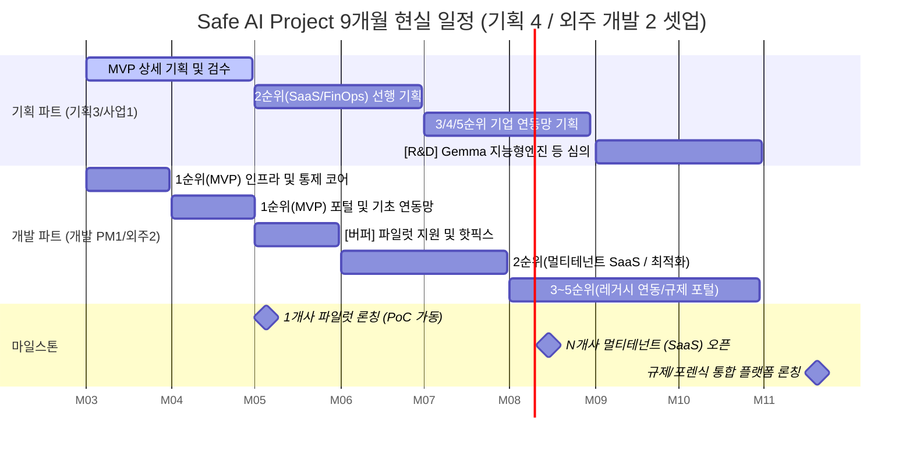

# Safe AI MVP 가설적 일정표 및 WBS

**자원(Resource) 현황 분석**
* **기획/사업 파트 (4명):** 사업 PM 1명 + 기획자 3명 (디자인은 AI 활용 대체)
* **개발 파트 (3명):** 개발 PM 1명 + 외주 개발자 2명

💡 **전략적 인사이트:** 기획 인력(4명)이 실제 코딩 인력(3명)보다 많은 **'기획 Heavy' 조직**입니다.
따라서 개발 파트에서 병목(Bottleneck) 현상이 발생할 확률이 높습니다. 이를 해결하기 위해 기획 파트는 개발 파트보다 항상 1.5개월~2개월 먼저 선행 기획(N+1, N+2)을 끝내서 외주 개발자가 명확한 문서(화면 설계서 등)를 보고 곧바로 코딩에만 집중할 수 있도록 해야 합니다. AI를 활용한 디자인을 적용하므로 기획 속도를 극대화할 수 있습니다.

---

## 📊 1. 가설적 9개월(Q2~Q4) 현실적 WBS Gantt Chart
(※ 외주 개발 리소스와 파일럿 안정화 변수를 철저히 반영한 9개월 일정)

---

## 📅 2. Phase별 상세 세부 업무 (9개월 확장판)

| 일정 (기간) | 진척 단계 | 기획 파트 (기획 3 + 사업 1) 업무 | 개발 파트 (개발 PM 1 + 외주 2) 업무 |
|:---:|:---|:---|:---|
| **Phase 1 (3~4월)** | **1순위(MVP) 개발** | **[MVP 검수 및 PoC 준비]** - 이미 설계된 MVP 기능 상세 검수 - 1개사 파일럿 영업 (5월 시작 목표) | **[아키텍처 및 1순위 코어 공사]** - 클라우드 환경 및 인프라 구축, 기초 마스킹(DLP) - 어드민/유저 포털 배포 및 단일 SSO/SIEM 연동 |
| **Phase 2 (5월)** | **MVP 론칭 & 안정화** | **[SaaS 준비 및 고객 피드백]** - 파일럿 고객사 발굴 완료 및 QA 지원 - 2순위(멀티테넌트 SaaS) 정책 설계 착수 | **[1개사 파일럿 집중 버퍼 기간]** - 5월 파일럿에서 발생하는 버그/VOC 핫픽스 - 시스템 가용성(안정성) 최적화에 전력 (신규 개발 보류) |
| **Phase 3 (6~7월)** | **2순위(SaaS) 전환** | **[다중 아키텍처 연동 기준 수립]** - N개사용 다중 인증망(SAML/OAuth) 명세화 - FinOps 과금 최적화 효율성 홍보 | **[멀티테넌트 아키텍처 대공사]** - 단일 DB를 N개사 격리 구조로 이관 및 K8s 적용 - 캐싱(Caching)을 통한 과금 최적화 엔진 구축 |
| **Phase 4 (8~9월)** | **3순위(레거시) 개발** | **[엔터프라이즈 특화망 분석]** - 결재망(권한 브릿지) 등 사내 레거시 구조 분석 - 금융/방산권 폐쇄망 PoC 인프라 가이드 세팅 | **[엔터프라이즈 다중망 연동 릴리즈]** - 고객사의 최심층 아키텍처(사내프롬프트 결재) 포팅 - 폐쇄망 구축형 하이브리드 sLLM 연동 보강 |
| **Phase 5 (10~11월)** | **4순위 및 R&D 돌입** | **[차세대 R&D 과제 심의 & 차기 론칭]** - Gemma 기반 AI-DLP 실현 타당성 딥 심의 - 동형암호 기술 등의 적용 한계점/학술성 검토 | **[규제/감사 포털 완성]** - 로그 위변조 보관(WORM) 적용 및 감리 리포트 자동화 - 이상 행위 탐지(UEBA) 룰/비슷 엔진 적용 배포 |

---

## 🛠️ 3. Resource 최적화 솔루션 (제언)
1. **외주 개발자의 업무 한계 설정:** 외주 개발자(2명)에게 기획의 여백(모호한 설계)을 채우게 하면 절대 안 됩니다. 기획자가 3명이나 있으므로, 개발자가 화면을 보고 곧바로 작업할 수 있을 정도의 **수준 높은 AI 기반 산출물**이 제공되어야 개발 기간을 단축할 수 있습니다.
2. **개발 PM의 역할 분배:** 개발 PM 1명은 외주 개발자의 코드를 리뷰하고(Quality Assurance), K8s/보안 아키텍처 등 **코어 설계(DevOps)에만 집중**해야 합니다.
3. **AI 디자인 활용:** 기획자 3명 중 1~2명은 `Figma + AI 플러그인(또는 v0, Webflow 등)`을 적극 이용하여 퍼블리싱 단계를 극도로 압축해 주어야 프론트엔드 외주 인력의 공수를 줄일 수 있습니다.

---

## 🎯 4. 분기별 파일럿 운영 및 비즈니스 마일스톤

WBS 상의 개발 일정(Phase)과 연계되어 확보해야 하는 비즈니스/세일즈 및 운영 목표입니다.

*   **2Q (5~6월) - MVP 파일럿 온보딩:**
    *   초기 1개사 대상 파일럿 적용(PoC) 확보 및 맞춤형 연동 환경 셋업 완료.
    *   범용 API 연동 가이드라인 초안 배포 및 Safe AI B2B 영업덱 고도화.
    *   경영진 보고용 사업 계획서 및 기획(DT) 산출물 도출.
*   **3Q (7~9월) - 성능 검증 및 다중 연동:**
    *   실트래픽 환경 하에 3대 핵심 가치(보안, 생산성, 비용) 입증 (외부 유출 차단율 100%, 토큰 사용량 오차율 0%).
    *   외주사 품질 관리(SRM): SLA 보장, 보안 서약서 체결 등 개발 산출물 관리.
*   **4Q (10~12월) - 유료 계약 전환 및 확대:**
    *   고객사 보안팀 공식 리뷰 패스 및 1차 파일럿 유료 본계약(Subscribe) 전환.
    *   레퍼런스를 바탕으로 신규 Pilot 고객사 확장.

---

## 📋 5. 주요 추진 To-Do 리스트 (Project Checklist)

- [ ] **투자/경영 영역:** 외주 인프라 비용 산정, 예상 ROI 분석, 투자 심의용 사업계획서 확정
- [ ] **외주사 관리(SRM) 영역:** 요구사항 명세서(SOW), 외주사 평가 기준, SLA 및 NDA 제정
- [ ] **인수인계 및 환경 분리:** 기존 산출물 현행화, 망분리된 외주 분리 환경 세팅 허가
- [ ] **세일즈/마케팅 영역:** 파일럿 고객사용 요금제(Pricing Tier) 가안 수립 및 영업덱 제작
- [ ] **규제/보안 대응:** 망분리 예외 조항 연계 검토, 솔루션 제3자 취약점 점검 의뢰 증빙 확보
