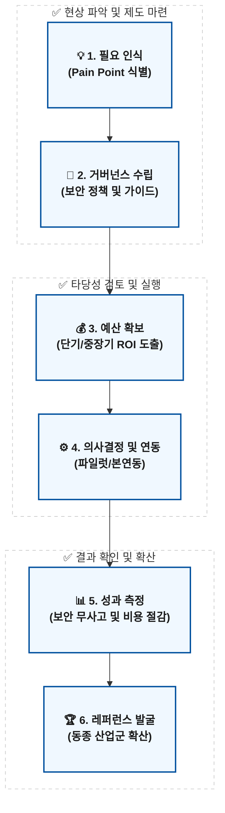

# 📊 고객사 AI 보안 솔루션 도입 여정 (Adoption Flow)

본 문서는 고객사가 당사의 AI 보안 솔루션을 도입하는 전체 6단계 프로세스를 도식화한 PPT 구조 및 다이어그램입니다. 각 단계별로 슬라이드를 구성하여 고객사 경영진/현업/보안팀을 설득하는 세일즈/가이드 문건으로 활용 가능합니다.

---

## 1. 프로세스 요약 도식 (Mermaid Flowchart)

---

## 2. PPT 슬라이드별 핵심 구성 (Slide Deck Outline)

### [Slide 1] 도입의 징후: 고객사의 필요 인식
* **시장 상황:** 생성형 AI 도입의 폭발적 수요와 망분리 및 컴플라이언스(보안 규제)의 정면 충돌
* **현장 실태:** 실무진들의 섀도우 AI(Shadow AI) 사용 증가로 인한 민감 데이터 유출 리스크, 가시성 부재
* **우리의 역할:** "보안을 지키면서도 AI의 압도적 생산성을 누릴 수는 없을까?"에 대한 솔루션 필요성 환기

### [Slide 2] 기반 마련: AI 보안 거버넌스 수립
* **고객의 한계:** "하고 싶지만 가이드라인 구성을 어디서부터 시작해야 할지 모름"
* **우리의 해결책:** 타겟 고객 맞춤형 'AI 거버넌스 프레임워크' 제공 및 자문
* **기대 효과:** 보안 부서의 통제력을 회복하고, 자사가 제공하는 프록시 아키텍처(PII 마스킹, 감사 로그 등)를 고객사 사내 표준 지침으로 명문화 유도

### [Slide 3] 투자 타당성 증명: AI 도입을 위한 예산 확보
* **의사결정 허들:** 솔루션 도입 예산 결재 시 경영진의 명확한 비용/효용(ROI) 요구
* **우리의 해결책:** 도입 전후 비교(단축된 개발 리드타임 + LLM 직접 사용량/비용 절감) 시뮬레이션 제공
* **기대 효과:** 보안팀의 방어 예산뿐만 아니라, 현업 부서의 혁신/인프라 예산까지 함께 끌어오는 통합 예산 명분 확보

### [Slide 4] 실행 단계: 도입 의사결정 및 솔루션 연동
* **과정 (PoC to Commercial):** 파일럿(PoC) 결과를 바탕으로 본계약 여부 의사결정
* **기술적 우위 (Fast Integration):** 사내 구축 망분리 환경 및 클라우드 VPC 구애받지 않는 표준 연동 가이드 및 SDK 제공 (3일 이내 초고속 API 연동)
* **결과 지표:** Time-to-integration 리드타임 최소화, 기존 레거시 코드 수정의 거의 제로화 달성

### [Slide 5] 가치 증명: 도입에 따른 성과 측정
* **측정 지표 (3대 성공 요인):**
  1. 보안 무사고율 및 식별/마스킹된 민감정보 현황 리포트
  2. 개발(현업) 부서의 리드타임 단축 등 실질 생산성 증대치
  3. 토큰 최적화 및 로컬 캐싱을 통한 LLM API 직접 요금 절감액
* **우리의 솔루션:** 경영진, 보안팀이 한눈에 파악 가능한 '실시간 성과 대시보드(ROI Dashboard)' 제공

### [Slide 6] 확산 전략: 산업군별 레퍼런스(Reference) 확보
* **파급력 및 마케팅:** 본연동 성공 고객사를 앵커(Anchor) 모델로 삼아, 동일 산업군(예: 제1금융권, 공공기관) 타 고객사에 공격적 어프로치
* **기대 효과:** "경쟁사 A은행도 안전하게 도입해서 쓴다더라" 형태의 밴드왜건(Bandwagon) 효과 창출 및 긴 세일즈 사이클의 획기적 단축
* **최종 목표:** 특정 규제 산업군 내에서 ‘안전한 엔터프라이즈 AI 프록시 표준(De facto standard)’으로 자리매김
