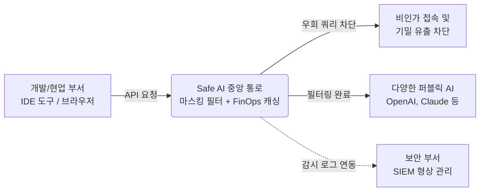

# 📊 Safe AI 플랫폼 투자심의 문서 (v3)

---

## 1. 서비스 출시 및 투자 목적

본 투자는 무분별한 섀도우 AI 사용에 따른 사내 기밀 유출 리스크를 방어하는 동시에, 개발/현업 부서의 AI 툴(Copilot 등) 활용 생산성을 온전히 보장하기 위한 **전용 지능형 프록시 인프라**를 시장에 선제적으로 출시하기 위함입니다. 이를 통해 B2B 엔터프라이즈 특화 AI 통제 시장을 선점하고, 클라우드 기반 구독형 모델(SaaS) 안착을 통해 장기적이고 안정적인 MRR(월간 반복 매출) 수익 기반 및 자사 네트워크 결합 상품(Bundle) 시너지를 확보하는 것을 궁극적 목표로 합니다.

---

## 2. 사업시행 목적 및 추진 배경

최근 글로벌 산업 전반에 걸친 'AI 전환(AX)' 트렌드 속에서, 역설적이게도 국내 대다수의 대기업 및 금융권 환경에서는 소스코드 유출과 같은 보안 위협을 우려하여 사내 인프라 단에서의 인공지능 API 및 개발자 툴 접속을 엄격히 차단하고 있습니다. 이로 인해 임직원들의 글로벌 업무 생산성 경쟁력이 급격히 저하되는 모순적 상황(Pain-point)이 극에 달한 시점입니다. 이와 같은 정체된 병목 현상을 타개하고 시장의 잠재적 수요를 실질적 매출로 흡수하기 위해 지금 즉시 본 사업을 전개해야 합니다.

* **최적의 시장 형성 및 규제 완화 (Timing & MLS)**
  정부 차원의 공공/금융 망분리 규제 완화 기조(MLS 방침 등)에 따라 수많은 보안 기관들이 외부 퍼블릭 클라우드 및 생성형 LLM 서비스와의 통신 연동을 준비하고 있습니다. 하지만 그 전제 조건으로 '안전하게 필터링된 데이터만 역외로 내보낼 수 있는 초정밀 통제 게이트웨이' 도입이 요구되면서, 당사의 프록시 기반 AI 검열 라우터 인프라가 필수 컴플라이언스 요건으로 강제성을 확보하게 되었습니다.
 
* **법제화 임박 상황 선제 대응**
  다가오는 2026년 인공지능 기본법 시행 및 데이터 보호 책임의 강화에 편승하여, C-Level 경영진들에게 있어 단순한 텍스트 챗봇 차단을 넘어 전체 회사 차원의 섀도우 AI 활동을 감시하는 'AI-SPM(보안 형상 관리)' 솔루션 채택은 더 이상 미룰 수 없는 IT 투자 최우선 순위(Top Priority)가 되었습니다.

* **경쟁 공백과 전략적 선점 한계 시일**
  기존 범용 DLP 공급사들은 웹페이지 단위의 제어에 머물러 있어, 복잡한 개발자 전용 IDE 연동이나 에이전트 간 백도어(MCP 통신 등) 제어 영역에는 즉각적인 대응을 하지 못하고 있습니다. 틈새이자 고부가가치 시장인 이 영역에서 초기 진입을 서두른다면 B2B 락인율을 독점할 수 있는 적기입니다.

---

## 3. 상품/서비스 개요

Safe AI 솔루션은 각기 흩어진 기업의 생성형 AI 트래픽(ChatGPT, Claude, 사내 모델, 개발 툴)을 단일 통로로 집중하여 제어하는 중앙 집중식 통합 보안 게이트웨이 플랫폼입니다. 단순 데이터 보호 기능을 넘어 API 과금을 통제하는 FinOps 요소가 탑재되어, 보안성을 높이면서도 전사 IT 지출을 줄일 수 있도록 구조화되어 있습니다.

**[Safe AI 주요 서비스 아키텍처 및 핵심 모듈군]**

| 모듈 명칭 | 제공 기능 구성 요소 (Features) | 기업 도입 효과 (Value Proposition) |
|---|---|---|
| **지능형 다중 프록시** (AI DLP Routing) | • 복수 LLM 단일 API 파이프라인 통합 • 정규식 및 JSON 기반 인라인 실시간 마스킹 | • 툴 활용을 보장하면서 내부 기밀 외부 유출 원천 차단 • 외부 데이터 흐름의 완전 가시화 |
| **비용 최적화 엔진** (AI FinOps Caching) | • 질의 시맨틱 캐싱(Semantic Caching) • 라우팅 폴백 통제 및 API 한도(Quota) 할당 | • 불필요한 중복 AI 호출 토큰 삭감 • 과다 발생할 수 있는 클라우드 과금 통제 및 ROI 증명 |
| **운영/감사 포털** (Unified AI-SPM) | • 사용자/부서 단위 접근 Key 발급 대시보드 • 전체 원시 로그 보관, 범용 SIEM 포맷 이관 | • 회사 전반의 섀도우 AI 활동 이력 감리 • 규제 방어용 리포팅 수집 채널 개방(Webhook/JSON) |

**[핵심 구조 이해도 (개념망)]**

---

## 4. 사업성 분석

**1) 3C 분석**
* **Customer (고객/시장 환경 분석)**
  * *현황/니즈:* 클라우드 연결성에 목마른 임직원 1,000명 이상의 금융/공공 및 거대 제조 산업군. 기존의 원천 차단 방식으로는 글로벌 경영 경쟁의 손실이 너무 커 합리적인 통제가 절실한 고객.
  * *핵심 문제점(Pain-point):* 
    * [보안 담당자]: 망 혼용으로 인해 언제 누가 어떤 소스코드나 고객 개인정보를 챗봇에 입력했는지 현황 파악 불가 및 통제 불가.
    * [현업/개발자]: 업무 강도가 높은 코딩 및 사무 툴(Copilot 등)에 대한 일괄 차단 규제로 생산성이 퇴보 중인 업무 환경.
* **Competitor (주요 경쟁사 및 대체재)**
  * *현황:* 전통적인 텍스트 기반 차단을 지원하는 SECaaS 벤더 및 기존 DLP 업체들 다수.
  * *당사 강점(USP):* 정규식 단어 차단을 넘어, 최근 신종 등장하는 자율 AI 에이전트 간 통신(MCP, A2A) 우회 로직을 단일 파이프라인에서 종합 제어 가능한 차별성 설계. 그리고 시맨틱 캐싱을 통해 단순 요금 낭비를 막는 FinOps 결합 구조.
  * *열위 포인트 및 리스크 개선 방안:* 기존 거대 보안 벤더들이 축적해 온 방대한 위협 로그 DB 양에서 초기 열외에 놓일 수 있음. 이를 극복하고자 **[단기]** 첫 고객사 MVP 파일럿(PoC) 밀착 모니터링을 통한 룰셋 즉시 튜닝 및 초기 오탐 제어, **[장기]** 9개월 인프라 구축 직후부터 Gemma 등 선행 지능형 sLLM 엔진의 내재화 검토를 통해 문맥 추론 성능을 격상시키는 R&D 이원화 전략을 채택.
* **Company (자사 역량)**
  * 엔터프라이즈 B2B 유선망 트래픽 처리 역량과 기존 SASE 보안 구축에 대한 강력한 레퍼런스 노하우 및 B2B 직영 영업 결합 자산(Bundling 능력) 보유.

**2) 4P 전략**
* **Product**: DLP 프록시 릴레이 인프라 및 관리 통제용 SaaS 관리자/유저 대시보드.
* **Price**: 설치 부담 단가를 제거한 구독/종량제 요금 구조. (Light / Pro / Enterprise) 트래픽 사용 과금제 채택.
* **Place**: 기존 B2B 통신 가입 타겟으로 하는 직판 인바운드 영업. 대외 클라우드 마켓플레이스 등록 병행.
* **Promotion**: 자사 네트워크 솔루션 가입사 대상 단기 무상 파일럿 프로그램 적용, B2B 보안/클라우드 기술 컨퍼런스 적극 제휴.

**3) STP 전략**
* **Segmentation**: 전체 AI 활용 대상 기업 중, 보안 규칙이 우선되는 특수 망분리 컴플라이언스 대상 산업망.
* **Targeting**: 보안 요구 강도와 지불 역량이 높은 **임직원 1,000명 이상의 대형 엔터프라이즈 부서 및 금융 클러스터**를 최초 집중 타겟팅.
* **Positioning**: 보안과 툴 활용의 딜레마 사이에서 양쪽의 요구를 가장 합리적으로 맞추는 '제로 트러스트 제어 통합 인프라'.

---

## 5. 일정

가용 리소스 효율 극대화 및 투심 범위를 최적 반영한 **투트랙 릴리즈(상품/사업화) 로드맵**입니다.

* **[상품화 기반 일정 (Product Track)]**
  * **시장 기회 발굴**: 망분리 완화 동향 조사 및 보안 통제 기능 소요 추출. (완료)
  * **상품 설계**: 포털 및 프록시의 기획 뼈대(MVP, SaaS 멀티테넌트) 문서화. (완료)
  * **개발 설계 검토 및 협의**: AWS 기반 아키텍처 점검 및 API 파이프라인 연계 협의. (현구간)
  * **상품 개발**: 코어 엔진 통제 기능, 시맨틱 캐싱(FinOps) 인프라 제작, 어드민 기능 코딩.
  * **개발 검증**: 주요 타겟사 1곳 지정 후 현장 파일럿 실환경 트래픽 부하 및 마스킹 오탐률(SLA) 테스트 진행.
  * **MVP 출시 및 고도화 개발**: 파일럿 안정화 완료 후 N개사 분산 수용을 위한 멀티테넌트 아키텍처 스케일업(K8s) 고도화 및 정식 개방.

* **[사업화 기반 일정 (Business Track)]**
  * **투자 심의**: R&D 트랙(지능형 엔진 등)의 과감한 분리 등 보수적 자본 타당성을 고려한 사업성 및 진행 여부 1차 확정. (투심 결의)
  * **판매/마케팅 전략 수립**: K8s 기반 멀티테넌트 SaaS 구조 전환 시점과 인건비 지출 등을 산출하여 종량 수수료 적정 수준 결정. B2B 영업판로(세일즈 번들링 패키지) 가동.
  * **출시 의사결정**: 파일럿 기업의 실증 운영 결과 도출 직후, 본 시장 진출 및 상업적 정식 서비스 오픈 여부 최종 서명.
