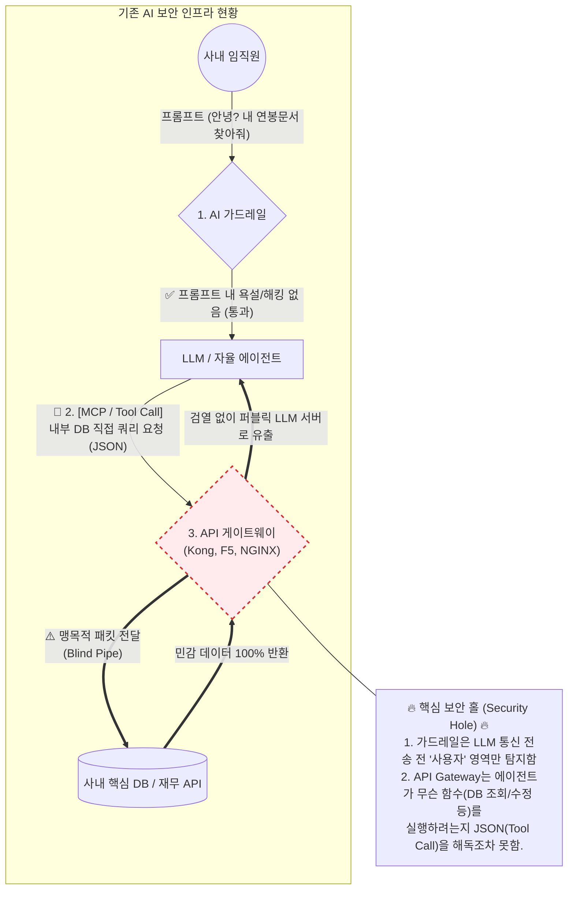
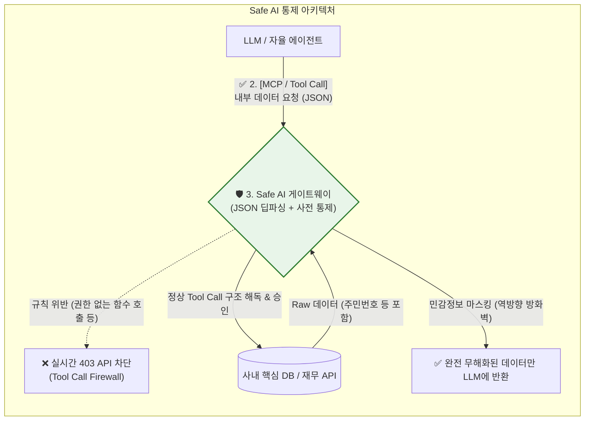

# 차세대 AI 보안 아키텍처: 기존 API 게이트웨이(F5/Kong) 대비 차별화 (MCP & A2A 중심)

본 문서는 사내 AI 인프라 확장을 고민하는 **'보안 담당자'**를 설득하기 위해, 기존 API Gateway(F5, Kong, Nginx)가 절대 막아낼 수 없는 자율형 에이전트(Agentic AI) 통신의 맹점을 분석하고 **Safe AI만의 3대 보안 차별화 기능 및 아키텍처 구현 방안**을 정리한 전략 마크다운입니다.

---

## 1. 🚨 보안의 패러다임 변화와 기존 장비의 치명적 한계

향후 모델 컨텍스트 프로토콜(MCP)과 Agent-to-Agent(A2A) 통신이 사내에 도입될 경우, 보안의 핵심 위협은 "사람이 악성 프롬프트를 넣는 것"이 아니라 **"거대 LLM(에이전트)이 회사 내부 시스템을 직접 뒤지고, 기계들끼리 데이터를 주고받으며 외부로 유출하는 것"**이 됩니다. (기존 가드레일 사업은 이를 막지 못합니다.)

### ⚠️ [시각화] 기존 환경(Guardrail + 일반 Gateway)의 보안 홀(Hole) 매핑
아래 다이어그램은 **'사람(사용자)'만 감시하는 가드레일**과 **'데이터 트래픽'만 나르는 F5** 사이에서, 통제받지 않는 **에이전트(LLM)**가 사내 영역을 직접 타격할 때 발생하는 치명적인 보안 블라인드 스팟(Blind Spot)을 보여줍니다.

### 기존 API 게이트웨이 (F5, Kong, NGINX)의 구조적 맹점
1. **눈먼 파이프 (Blind Pipe):** F5 등은 전통적인 HTTP(L7) 트래픽을 목적지로 보내는 데 특화된 라우터입니다. 이들은 LLM이 던지는 복잡한 실시간 JSON-RPC (MCP) 페이로드나 `Tool Calls` 배열의 구조를 까보지 못합니다. 
2. **All-or-Nothing 권한 통제:** A2A 통신에서 기존 장비들은 인증 토큰(JWT, API Key)만 맞으면 통과시킵니다. "사원 연봉 열람 권한이 탈취된 에이전트"가 데이터를 대량 다운로드해도 **의도(Intent)**를 파악할 지능이 없어 속수무책으로 당합니다.

---

## 2. 🛡️ Safe AI만의 3대 차별화 보안 기능 (+α) 및 구현 방안

### ✨ [시각화] 패러다임 전환: Safe AI의 제로 트러스트 아키텍처
비어있던 '맹목적 파이프' 자리에 Safe AI 프록시가 투입되어, LLM이 내부 데이터를 끄집어내는 **Tool Call JSON 페이로드의 맥락과 의도를 완벽히 통제**합니다.

전통적인 네트워크 패킷 스니핑 방식을 버리고, **"JSON 딥 파싱 + 게이트웨이 결합형 SLM(경량 AI)"**을 통한 차별화된 구현 아키텍처를 제공합니다.

### ① AI Tool Call Firewall (MCP 함수 호출 통제)
* **어필 포인트:** "에이전트가 내부 DB 데이터를 조작(Update/Drop)하는 함수를 호출할 때, F5는 그걸 들여다볼 수 없습니다."
* **기능 설명:** LLM이 사내망에 접근할 때 던지는 `tool_choice`와 실행 의도를 실시간으로 해독하여, 사전에 정의된 (인가된) 내부 도구만 사용하도록 차단하는 명세서(Schema) 기반 방화벽 기능입니다.
* **구현 아키텍처:**
  * **SSL Termination:** Safe AI가 사내망 프록시로서 인증서를 터미네이션하고 암호화 터널 안쪽의 순수 JSON 페이로드를 가로챕니다.
  * **Declarative 화이트리스트:** 부서/에이전트 별로 선언된 YAML 룰에 따라 인가되지 않은 함수(Function Call) 포착 시 `403 Forbidden`을 뱉으며 즉시 연결을 끊어버립니다.

### ② Agent-to-Agent (A2A) Semantic Firewall (시맨틱 방화벽)
* **어필 포인트:** "기계들끼리 데이터를 주고받을 때 인증키만 맞으면 데이터를 다 넘겨줍니까? 의도(Intent)를 판단하지 않으면 대형 유출로 이어집니다."
* **기능 설명:** A2A 통신에서 정규식이나 키워드 필터링을 우회하는 정교한 데이터 접근 및 탈취 맥락을 인지하고 차단합니다.
* **구현 아키텍처:**
  * **내장형 Fast SLM 융합:** 게이트웨이 단에 **50ms 미만의 지연 시간(Latency)을 갖춘 판단 전용 경량 판별 모델(SLM, 예: Llama-3-8B 또는 튜닝된 RoBERTa)**이 결합되어 있습니다.
  * **Intent-based Blocking:** A2A JSON 페이로드를 비동기로 SLM이 스코어링하여, "맥락에 맞지 않는 불건전한 기밀 데이터 접근"으로 판별될 경우 L7 단의 네트워크 트래픽을 즉시 Drop 시킵니다.

### ③ 역방향 RAG 데이터 마스킹 (Outbound Exfiltration Prevention)
* **어필 포인트:** "사용자 질문은 기존 가드레일이 막습니다. 하지만 MCP가 읽어들인 내부 DB 결과(주민등록번호 등)가 LLM 서버로 넘어갈 때, 역으로 유출되는 건 누가 막습니까?"
* **기능 설명:** Inbound 필터링이 아닌, **내부 시스템이 LLM에게 되돌려주는(Tool Output) 결괏값**에 대한 아웃바운드 검열 및 마스킹입니다.
* **구현 아키텍처:**
  * 데이터 파이프라인에서 응답 JSON이 외부 퍼블릭 클라우드(OpenAI 등)로 전달되기 직전, 구조화된 민감 정보(주민번호, 계좌 등)를 실 실시간 치환(Redaction)하여 클라우드 유출을 물리적으로 차단합니다.

---

## 3. 🎯 핵심 세일즈 딜리버리 메시지 (보안 담당자용)

> "보안 담당자님, 기존에 도입하신 가드레일은 **'임직원'**들이 이상한 코드를 넣는 걸 막아주는 든든한 1차 방패입니다. 하지만 말씀하신 MCP나 A2A의 영역은 관점이 완전히 다릅니다. 이젠 방어의 대상이 사람이 아니라 **'우리 회사 심장부를 직접 조회(Tool Call)하려는 기계 (AI 에이전트)'**입니다."

> "Kong이나 F5는 그저 패킷의 암호화 터널을 열어주는 L7 라우터일 뿐, 터널 안에서 에이전트가 어떤 함수를 실행하는지(JSON 페이로드) 까보고 통제할 수 없습니다. 저희 Safe AI는 게이트웨이 단에서 프록시 서버와 경량 AI 모델(SLM)을 결합하여, 기계 간의 통신과 함수 호출의 '맥락'을 50ms 안에 끊어버리는 **AI 시대를 위한 유일한 제로 트러스트(Zero Trust) 세관**입니다."
