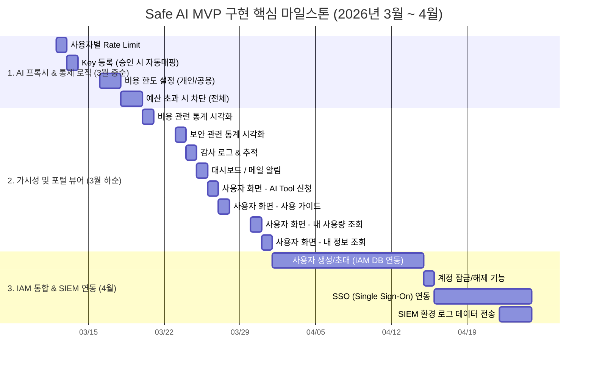

# 📊 Safe AI MVP - WBS (Work Breakdown Structure)

---

## 1. WBS 전체 내역표

| 대분류 (영역) | 중분류 | 소분류 (Task) | 상세 내용 (개발 여부 등) | 시작 일정 | 종료 일정 |
| :--- | :--- | :--- | :--- | :--- | :--- |
| **IAM 및 인증 영역** | 계정 관리 | 사용자 생성/초대 | - | 2026-04-01 | 2026-04-14 |
| | | 계정 잠금/해제 | - | 2026-04-15 | 2026-04-15 |
| | 인증 관리 | SSO 연동 | - | 2026-04-16 | 2026-04-24 |
| | | MFA 설정 | 알파키 MFA 사용 / 별도 개발 없음 | - | - |
| **네트워크 및 접근제어 영역** | 접속망 관리 | IP 화이트리스트 설정 | Cloudflare WAAP / 별도 개발 없음 | - | - |
| | | 해외 IP 차단 | Cloudflare WAAP / 별도 개발 없음 | - | - |
| | 디바이스 관리 | 관리 단말 등록 | 알파키 기능 사용 / 별도 개발 없음 | - | - |
| | | 비인가 단말 차단 | 알파키 기능 사용 / 별도 개발 없음 | - | - |
| **AI 프록시 영역** | 요청 인증 및 식별 | API Key 유효 검증 | 기존 코드 활용 | - | - |
| | | 사용자 유효 검증 | 기존 코드 활용 | - | - |
| | 요청 정책 관리 | 사용자별 Rate Limit | - | 2026-03-12 | 2026-03-12 |
| **데이터 보호 (AI-DLP)** | 개인정보 보호 | 주민등록번호 탐지 | 기존 json 파일 적용 | - | - |
| | | 휴대전화번호 탐지 | 기존 json 파일 적용 | - | - |
| | | E-mail 탐지 | 기존 json 파일 적용 | - | - |
| | 조치 정책 관리 | 마스킹 | 기존 json 파일 적용 | - | - |
| **비용 및 사용량 통제** | API Key 관리 | Key 등록 | Key 매핑은 툴 신청 승인시 자동 매핑 | 2026-03-13 | 2026-03-13 |
| | | Key 암호화 저장 | 기존 코드 활용 | - | - |
| | | Key 사용량 조회 | 기존 코드 활용 | - | - |
| | 사용량 정책 관리 | 비용 한도 설정 (개인/공용) | - | 2026-03-16 | 2026-03-17 |
| | 비용 통제 정책 | 예산 초과 시 차단 (전체) | - | 2026-03-18 | 2026-03-19 |
| **가시성/로그/ 감사 영역** | 활용 로그 관리 | 요청 로그 저장 | 기존 코드 활용 | - | - |
| | | 응답 로그 저장 | 기존 코드 활용 | - | - |
| | 보안 로그 관리 | 위반 이벤트 기록 | 기존 코드 활용 | - | - |
| | 대시보드 | 비용 관련 통계 시각화 | - | 2026-03-20 | 2026-03-20 |
| | | 보안 관련 통계 시각화 | - | 2026-03-23 | 2026-03-23 |
| | | 감사 로그 & 추적 | - | 2026-03-24 | 2026-03-24 |
| | SIEM 연동 | 로그 데이터 전송 | - | 2026-04-22 | 2026-04-24 |
| **운영 및 가용성 영역** | 사용량 알림 설정 | 메일 알림 설정 | - | 2026-03-25 | 2026-03-25 |
| **사용자 포털 영역** | 대시보드 | 대시보드 | - | 2026-03-25 | 2026-03-25 |
| | AI Tool 신청 | AI Tool 신청 | - | 2026-03-26 | 2026-03-26 |
| | AI Gateway 사용 | AI Gateway 사용 | - | 2026-03-27 | 2026-03-27 |
| | 내 사용량 | 내 사용량 | - | 2026-03-30 | 2026-03-30 |
| | 내 정보 | 내 정보 | - | 2026-03-31 | 2026-03-31 |

---

## 2. 개발 및 릴리즈 일정 간트 차트 (Gantt Chart)

