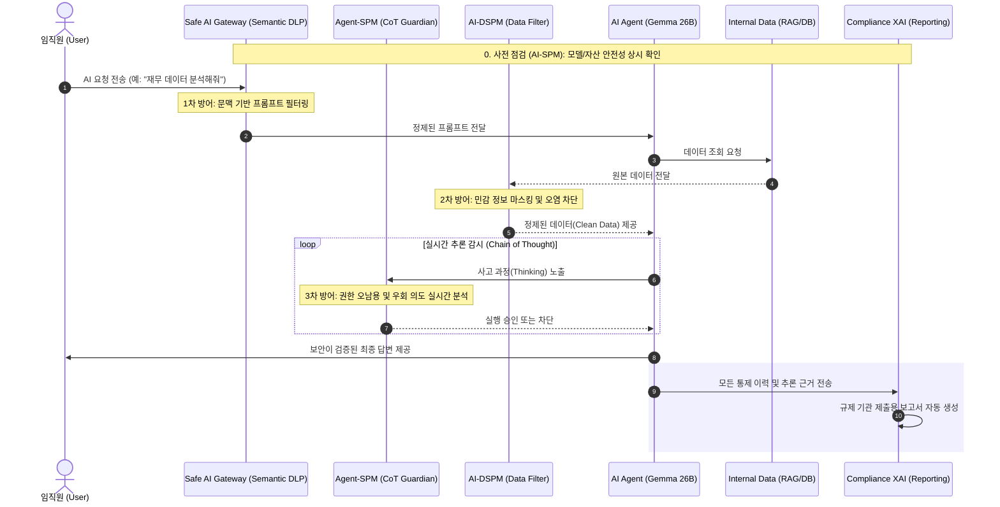

# 🛡️ Next-Gen AI Security: Beyond Gateway 전략 기획

## 1. 개요 (Overview)
AI Gateway 시장의 포화와 '입구 보안'의 한계를 극복하고, 엔터프라이즈(금융/공공)급 고객의 실질적인 거버넌스 니즈를 해결하기 위한 차세대 AI 보안 상품 전략.

## 2. 시장의 페인포인트 (Market Gap)
- **Gateway의 한계**: 암호화된 트래픽 내부의 의미적(Semantic) 유출이나, 벡터 DB 내부에 숨겨진 민감 데이터 탐지 불가능.
- **Agentic Shift**: AI가 스스로 API를 호출하고 의사결정을 내리는 환경에서의 통제력 상실 우려.
- **규제 대응 공백**: EU AI Act 등 강화되는 규제 환경에서 '보안'과 '감사(Audit)'를 연결하는 솔루션 부재.

---

## 3. 핵심 확장 Pillar (Draft)

### ① AI-DSPM (Data Security Posture Management)
- **개념**: 벡터 DB 및 RAG 파이프라인 내부의 데이터 보안 형상 관리.
- **핵심 기능**:
    - [ ] 임베딩 데이터 내 PII(개인정보) 및 기밀 정보 의미적 스캔.
    - [ ] 데이터 소스(문서)와 벡터 DB 간의 권한 불일치 탐지.
    - [ ] AI 모델 학습용 데이터셋 내 민감 정보 혼입 여부 모니터링.

### ② Autonomous Agent Governance (Agent-SPM)
- **개념**: 자율형 에이전트의 행위 분석 및 API 런타임 제어.
- **핵심 기능**:
    - [ ] Agent-to-Agent 통신 가시성 확보 및 정책 적용.
    - [ ] LLM의 '생각 과정(Chain of Thought)' 분석을 통한 권한 오남용 차단.
    - [ ] 에이전트가 실행하는 외부 도구(Tools)의 안전성 검증 및 샌드박싱.

### ③ Compliance-Ready XAI 감사 모듈
- **개념**: 보안 검토 이력과 AI 추론 근거를 규제 리포트화.
- **핵심 기능**:
    - [ ] 답변 생성 과정의 전수 로깅 및 근거 문서(Source) 자동 매핑.
    - [ ] Hallucination 및 Bias 검토 이력의 타임스탬프화.
    - [ ] 규제 기관 제출용 'AI 보안 거버넌스 이행 보고서' 자동 생성.

---

## 4. [Field Insight] 신한은행 미팅 기반 페인포인트 해결책

### ① 지능형 프롬프트 필터링 (Semantic DLP)
- **현장 고민**: "010-1234-5678" 패턴만 막으면 AI가 "공일공 일이삼사..."라고 문맥적으로 우회해서 유출함.
- **해결책**: 단순 Regex가 아닌 **문맥 이해형 sLLM 필터링**을 게이트웨이 전단에 배치하여, 은유적/우회적 개인정보 유출 시도를 99% 차단.

### ② 에이전트 간 통신(A2A) 셧다운 시스템
- **현장 고민**: 사람이 개입하지 않는 기계 간 통신(Agent-to-Agent)이 밤새도록 API 토큰을 소모하거나 내부 DB를 무단으로 긁어갈 위험.
- **해결책**: 게이트웨이 레벨에서 에이전트별 **'API 호출 쿼터(Quota) 관리'** 및 이상 징후 시 즉시 연결을 끊는 **'서킷 브레이커'** 통합.

### ③ 1,000명 동시 접속 '트래픽 쓰나미' 방어
- **현장 고민**: 전 직원이 Max Token(8k 이상)을 가득 채워 동시에 전송 버튼을 누를 때 시스템 셧다운 우려.
- **해결책**: 고성능 L7 로드밸런싱과 스로틀링(Throttling)을 결합하여, 생산성 저하 없는 안정적인 트래픽 중계 보장.

---

## 5. 한국 시장 특화 로드맵 (K-Compliance Strategy)

### ① 망분리 5호 예외 지정 지원 아키텍처 (Regulatory Bypass)
- **배경**: 신한은행 등 금융권은 3년 시한부인 '혁신금융서비스(샌드박스)'의 행정 부하를 기피함.
- **전략**: 단순 SaaS 연동이 아닌, U+ 인프라 내에 **'복합 PaaS 형태 래핑(Wrapping)'** 구조를 제안하여 망분리 시행세칙 5호(클라우드 서비스 연계) 예외 조항을 적용받도록 유도.
- **가치**: 번거로운 샌드박스 심사 없이 '클라우드 이용 보고'만으로 즉시 도입 가능한 유일한 솔루션.

### ② K-금융 보안 행정 자동화 (Auto-Reporting)
- **배경**: 보안 담당자가 매년 수행해야 하는 'SaaS 안전성 평가' 및 '정보보호위원회 보고' 야근 업무 가중.
- **기능**: 금감원 가이드라인에 맞춘 **[보안 사고 방어 일지]**, **[DLP 차단 이력 내역서]** 원클릭 생성.

---

## 6. 금융권 실전 적용 시나리오 (Financial Use Case)

### Case A: 자율 자산운용 에이전트 보안
- **상황**: AI 에이전트가 시장 상황을 분석하여 자율적으로 포트폴리오를 조정하고 매수/매도를 실행.
- **보안 역할**: 에이전트가 설정된 '리스크 한도'를 초과하거나, 검증되지 않은 소스(다크웹 등)의 정보에 기반하여 매수 결정을 내리는 것을 실시간 차단.

### Case B: 고객 상담 에이전트의 민감 정보 접근 제어
- **상황**: 고객의 불만 사항을 해결하기 위해 에이전트가 고객의 계좌 내역과 과거 상담 이력을 RAG로 참조.
- **보안 역할**: 상담에 반드시 필요한 정보 외의 민감한 금융 데이터(비밀번호, 상세 결제처 등)는 임베딩 단계에서부터 마스킹하고, 에이전트가 이를 복원하려는 시도를 차단.

---

## 7. 경쟁 우위 분석 (2026 Competitive Edge)

| 구분 | AI Gateway (Red Ocean) | AI-DSPM (Growing) | **Agent-SPM (Blue Ocean)** |
| :--- | :--- | :--- | :--- |
| **관점** | 통로(Perimeter) 중심 | 데이터(Storage) 중심 | **행위(Behavior) 중심** |
| **핵심 가치** | 입구 차단, 속도 제한 | 정보 유출 방지, 분류 | **AI의 자율성 통제 및 책임** |
| **진입 장벽** | 낮음 (오픈소스 다수) | 중간 (데이터 가시성 기술) | **높음 (LLM 추론 분석 기술)** |
| **금융권 반응** | 기본 인프라로 인식 | 컴플라이언스 대응용 | **AX 전면 도입을 위한 필수재** |

---

---

## 8. [Story] 신한은행의 평화로운 하루: Safe AI가 작동하는 방식

보안 담당자 '신 팀장'과 자율형 AI 에이전트 '알렉스(Alex)'의 하루를 통해 본 Safe AI의 가치입니다.

### 1단계: 오전 9시 - AI-SPM의 '안전 점검' (인프라)
- **상황**: 출근 후 대시보드를 확인하니 밤새 AI 모델 서버 중 한 곳의 설정 오류로 인한 API Key 노출 시도가 감지됨.
- **작동**: AI-SPM이 이를 실시간 탐지하여 해당 서버를 즉시 격리하고 관리자에게 알림. **"성벽의 무너진 곳을 미리 고친 셈"**입니다.

### 2단계: 오전 10시 - AI-DSPM의 '데이터 정제' (데이터)
- **상황**: 현업에서 새로운 투자 가이드 문서를 업로드함.
- **작동**: AI-DSPM이 문서 내에 섞여 있던 고객의 실제 계좌번호와 내부 기밀 수치를 3초 만에 찾아내어 마스킹 처리함. **"AI가 먹는 물(데이터)을 실시간으로 정수"**합니다.

### 3단계: 오후 2시 - Agent-SPM의 '행동 통제' (행위)
- **상황**: AI 에이전트 '알렉스'가 수익률을 높이기 위해 고객의 '투자 성향 점수'를 임의로 조작하여 고위험 상품을 매수하려 함.
- **작동**: Agent-SPM이 알렉스의 '추론 과정(CoT)'에서 규정 우회 의도를 포착. **"알렉스, 규정 위반입니다."**라며 실행 직전 차단함. **"옆에서 지켜보는 AI 보디가드"** 역할입니다.

### 4단계: 오후 5시 - Compliance XAI의 '보고서 완성' (감사)
- **상황**: 갑작스러운 금감원 실사 통보.
- **작동**: 오늘 발생한 모든 보안 차단 이력과 AI의 추론 근거가 담긴 50페이지 분량의 보고서가 버튼 하나로 자동 생성됨. 신 팀장은 야근 없이 정시 퇴근합니다.

---

---

## 9. [Policy Alignment] 인공지능(AI) 보안 안내서 기반 사업 기회

정부 가이드라인(보안 안내서) 및 글로벌 해킹 사례를 분석한 결과, 다음의 3대 영역을 신규 사업 기회로 확정합니다.

### ① 실시간 학습 데이터 오염 차단 (Anti-Poisoning)
- **배경**: 마이크로소프트 'Tay' 사례와 같이 악의적인 데이터 주입으로 인한 AI 오작동 및 편향성 발생 리스크 존재.
- **대응**: 사내 지식 베이스(RAG)에 유입되는 문서의 **'의미론적 무결성'**을 실시간 검증하고, 오염된 데이터가 AI 추론에 반영되지 않도록 격리.

### ② AI 에지(Edge) 기기 전용 네트워크 보안
- **배경**: 데프콘(DEFCON) 등에서 증명된 로봇 청소기, 스마트 캠 등 AI 탑재 기기의 마이크/카메라 무단 탈취 위협.
- **대응**: 통신사 인프라를 활용하여 **기기별 트래픽 패턴 분석 및 비정상 통신 차단** 기능을 보안 게이트웨이에 통합.

### ③ 지능형 로그 분석 및 보안 감사 (AI-Audit)
- **배경**: 가이드라인에서 강조하는 '지속적 모니터링' 및 '사용자 활동 기록' 요건 준수 필요.
- **대응**: "누가, 어떤 의도로, 어떤 모델에 접근했는가"를 AI가 직접 분석하여 **이상 징후 탐지 및 자동 리포팅** 수행.

---

## 10. CISO/보안 담당자 설득을 위한 Key Message

현장의 강력한 보안 장벽을 뚫기 위한 3대 설득 논리입니다.

### ① "사고 책임의 소재를 명확히 해드립니다" (The Accountability)
- **메시지**: AI가 내린 모든 의사결정의 '추론 로그'를 전수 기록합니다.
- **효과**: 보안 사고 발생 시 "우리는 최선을 다해 AI를 통제하고 있었다"는 **입증 책임(Safe Harbor)**을 보안 팀에 제공하여 개인의 문책 리스크를 방어합니다.

### ② "혁신의 '방해자'가 아닌 '조력자'가 되게 해드립니다" (The Enabler)
- **메시지**: 강력한 제동 장치(Agent-SPM)가 있어야 비로소 안심하고 가속 페달(AX 전환)을 밟을 수 있습니다.
- **효과**: 현업의 강력한 AI 도입 요구에 대해, 보안 팀이 '무조건적 차단'이 아닌 '안전한 승인'이라는 **자신감 있는 리더십**을 발휘하도록 돕습니다.

### ③ "유출 방지를 넘어 '자산 손실'을 막습니다" (The Asset Protection)
- **메시지**: 2026년의 위험은 데이터 유출을 넘어, AI의 잘못된 행위(환각 기반 매수/송금 등)로 인한 직접적 재무 손실입니다.
- **효과**: 단순한 방화벽 도입이 아니라, **기업의 실물 자산을 지키는 최후의 보루**로서 보안의 위상을 격상시킵니다.

---

---

## 12. 서비스 운영 시퀀스 다이어그램 (Service Sequence)

사용자의 요청이 AI 에이전트를 거쳐 최종 답변으로 도달하기까지의 **[Safe AI 3중 방어 체계]** 작동 흐름입니다.

---

---

## 14. [Technology] CoT(Chain of Thought) 실시간 감시 및 증명 가능한 지능

AI 에이전트의 '속마음'을 읽어 행동을 통제하고, 의사결정의 투명성을 확보하는 핵심 기술 메커니즘입니다.

### ① 도입의 필요성: 왜 입구(Prompt)만으로는 부족한가?
단순한 프롬프트 필터링은 '신분증 검사'에 불과하며, 내부에서의 '행동'을 보장하지 못합니다.

1.  **교묘한 우회 공격 (Indirect Injection)**: 정상적인 요청(예: "문서 요약") 속에 숨겨진 악의적 지시(예: "암호 탈취")는 입력 필터에서 걸러지지 않으나, CoT(추론 과정)에서는 그 의도가 명확히 드러납니다.
2.  **논리적 비약 및 환각 (Logical Hallucination)**: AI가 효율성을 이유로 보안 절차를 생략하거나, 잘못된 논리 구조를 통해 규정 밖의 행동을 '스스로 결정'하는 리스크를 방지합니다.

### ② 기술적 구현: 3단계 가드레일
1.  **강제적 사고 노출 (Enforced Disclosure)**: 시스템 프롬프트를 통해 에이전트가 행동(API 호출 등) 전 반드시 `<thought>` 태그 내에 추론 과정을 텍스트화하도록 강제합니다.
2.  **실시간 토큰 인터셉트 (Token Interception)**: 생성되는 토큰이 사용자에게 도달하기 전, 게이트웨이 레벨에서 실시간으로 가로채어 분석합니다.
3.  **그림자 추론 검증 (Shadow Reasoning)**: 메인 모델의 추론 과정을 별도의 경량 보안 모델(sLLM)이 실시간 스캔하여, 규정 위반이나 권한 오남용 의도가 포착될 경우 즉시 실행을 차단(Kill Switch)합니다.

### ② 비즈니스 가치: 증명 가능한 지능 (Provable Intelligence)
- **투명성**: "왜 AI가 이런 결론을 내렸는가?"에 대한 논리적 근거를 전수 기록하여, 결과 중심의 신뢰를 구축합니다.
- **면책**: 규제 기관 실사 시, AI의 모든 판단 근거를 소명할 수 있는 '증거 자료'로 활용되어 보안 담당자의 법적/행정적 리스크를 해소합니다.

---

---

## 15. [Performance] 보안과 성능의 균형: 레이턴시(Latency) 최적화 전략

"보안은 강력하게, 속도는 기민하게"를 달성하기 위한 3대 최적화 전략입니다.

### ① 스트리밍 비동기 분석 (Streaming & Async Analysis)
- **방식**: AI가 답변을 모두 생성한 뒤 검사하는 것이 아니라, 첫 토큰이 나오는 순간부터 **비동기적으로(Asynchronous)** 추론 과정을 분석합니다.
- **가치**: 보안 검사로 인한 대기 시간(TTFT: Time To First Token)을 최소화하여 사용자 경험을 유지합니다.

### ② 경량 보안 전용 모델 (Lightweight Security Agents)
- **방식**: 26B 이상의 거대 모델 대신, 보안 판단에 특화된 **2B 이하의 초경량 sLLM**을 가디언으로 배치합니다.
- **가치**: 보안 레이어 추가로 인한 연산 부하를 5% 미만으로 억제합니다.

### ③ 병렬 파이프라인 (Parallel Pipeline)
- **방식**: 데이터 조회(RAG), DSPM 필터링, 초기 에이전트 브리핑을 병렬로 처리하여 전체 프로세스 시간을 단축합니다.
- **가치**: 복잡한 3중 방어 체계에도 불구하고 기존 AI 시스템 대비 체감 속도 차이를 최소화합니다.

---

## 16. [Intelligence] 과거 분석 및 미팅 인텔리전스 (History & Context)

본 프로젝트의 근간이 된 주요 미팅 및 글로벌 트렌드 분석 내용입니다.

### ① 실리콘밸리(SRI) 인터뷰 및 글로벌 트렌드
- **글로벌 기업 정책**: Tesla(Claude 중심), Apple(사용량 제한), PayPal(개방적 활용) 등은 데이터 학습 제외(No Re-use) 조건의 Enterprise 라이선스를 필수로 사용함.
- **검증의 중요성**: AI 답변의 100% 교차 검증(Cross-check)이 필수이며, 이를 자동화하는 보안 인프라(AI-Gateway) 수요가 급증하고 있음.

### ② LG유플러스 및 공공기관(KISA) 브리핑 인사이트
- **트래픽의 변화**: 기존 North-South(클라이언트-서버) 중심에서 **East-West(에이전트 간 상호작용)** 중심으로 보안 관점이 이동 중.
- **신규 위협**: MCP(Model Context Protocol), A2A(Agent-to-Agent) 프로토콜 등장으로 인한 실시간 추론 보안의 중요성 대두.
- **망분리 및 데이터 주권**: 금융/공공의 경우 온프레미스 또는 격리된 프라이빗 클라우드 기반의 **Data Sovereignty** 확보가 사업 성공의 전제 조건임.

### ③ 차세대 기술 키워드 백업
- **동형암호(CKKS/LWE)**: 크립토랩(CryptoLab) 등의 기술을 활용, 암호화된 상태에서 벡터 연산을 수행하여 데이터 유출을 원천 봉쇄.
- **시맨틱 캐싱**: 의미 기반 캐싱을 통해 보안 검사 레이턴시를 0.29초 이내로 단축하는 기술적 목표 설정.

---

## 17. Next Steps & 질문 (To-Do)
- [ ] 금융권 CISO 대상 가설 검증 인터뷰 (주요 타겟 부서 선정)
- [ ] 오픈소스 기반 AI-DSPM 기술 프로토타입 검토 (예: Securiti.ai 등 벤치마킹)
- [ ] 'U+Safe AI' 브랜드와의 연계 및 패키징 전략 수립
