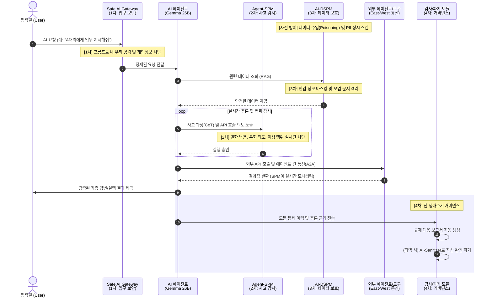

# 🛡️ Next-Gen AI Security: Beyond Gateway 전략 기획

## 💡 Executive Summary
본 전략은 LGU+의 차세대 성장 동력인 **'U+ Safe AI'** 플랫폼의 성공적 시장 안착을 위한 로드맵임. 기존의 단순 Gateway 보안을 넘어, AI 에이전트의 사고 과정(CoT)을 실시간 감시하는 **Agent-SPM**과 데이터 주권을 보장하는 **AI-DSPM**을 통합하여 **'Zero-Trust AI Governance'**를 실현함. 특히, **'Buy, Borrow, Build' (3B)** 전략에 따라 모놀리(Monoly)와의 독점 제휴를 통해 속도를 확보하고, 엑사원(Exaone)을 통해 기술적 해자(Moat)를 구축함.

---

## PART 1. 전략적 배경 (Strategic Context)

### 1. 개요 및 CEO 전략 방향 (Overview & Vision)
본 전략은 AI 모델의 **생성-운영-폐기(Lifecycle)** 전 과정에서 데이터 안전성과 추론 무결성을 보장하는 **'Full-Stack AI Governance' 체계** 구축을 목표로 함. 
- **CEO 'T-자형' 전략 부합**: 가로축의 MDR 서비스와 세로축의 Safe AI 특화 상품을 결합하여 보안 사업의 볼륨과 전문성을 동시에 확보.
- **Agentic AI 시대 대응**: 2026년 자율형 에이전트의 확산에 따라 AI의 '행위'를 통제하고 사고 발생 시 '입증 책임'을 다할 수 있는 인프라 구축 필수.

### 2. 시장 페인포인트 및 글로벌 표준 (Market Gap & AI TRiSM)
- **North-South의 한계**: 기존 Gateway는 외부 유입만 차단하나, 에이전트 간 통신(East-West) 및 모델 내부 데이터 변조(Poisoning)에는 무방비.
- **의미론적 우회(Semantic Evasion)**: 지능형 프롬프트 인젝션 및 은유적 개인정보 유출 급증.
- **Gartner AI TRiSM 기반 설계**: Trust(CoT 가시성), Risk(Semantic DLP/DSPM), Security(Agent-SPM)의 3대 핵심 영역을 완벽히 커버.

### 3. [Key] 3B 실행 전략 (Buy, Borrow, Build)
속도와 전문성을 동시에 확보하기 위한 LGU+만의 기술 확보 프레임워크.
1.  **Buy (Monoly Exclusive)**: 모놀리의 SaaS 보안 프록시 기술을 즉시 수혈하여 M365, Slack 등 엔터프라이즈 환경 즉시 대응.
2.  **Borrow (Partnership)**: 글로벌 보안 벤더 및 국내외 LLM 파트너와의 기술 제휴를 통해 멀티모달 보안 등 최신 위협 대응력 강화.
3.  **Build (Exaone Inside)**: 2027년까지 엑사원(Exaone) sLLM을 모든 보안 레이어의 '판단 엔진'으로 내재화하여 독보적인 기술 해자(Moat) 구축.

### 4. 경쟁 우위 분석 (2026 Competitive Edge)
> [!TIP]
> **Agent-SPM**은 단순 통로 보안(Gateway)을 넘어 AI의 '생각'과 '행위'를 실시간으로 통제하는 블루오션 영역임.

| 구분 | AI Gateway (Red Ocean) | AI-DSPM (Growing) | **Agent-SPM (Blue Ocean)** |
| :--- | :--- | :--- | :--- |
| **관점** | 통로(Perimeter) 중심 | 데이터(Storage) 중심 | **행위(Behavior) 중심** |
| **핵심 가치** | 입구 차단, 속도 제한 | 정보 유출 방지, 분류 | **AI의 자율성 통제 및 책임** |
| **진입 장벽** | 낮음 (오픈소스 다수) | 중간 (데이터 가시성 기술) | **높음 (LLM 추론 분석 기술)** |
| **금융권 반응** | 기본 인프라로 인식 | 컴플라이언스 대응용 | **AX 전면 도입을 위한 필수재** |

---

## PART 2. 통합 아키텍처 및 핵심 역량 (Architecture & Capabilities)

### 5. Safe AI 3중 방어 체계 (Sequence Diagram)
사용자의 요청이 AI 에이전트를 거쳐 최종 답변으로 도달하기까지의 **[Safe AI 3중 방어 체계]** 작동 흐름입니다.



### 6. [통합] 핵심 서비스 카탈로그 (Unified Catalog)

#### 🛡️ LAYER 1: 인바운드 게이트웨이 보안 (Inbound & Traffic Control)
- **지능형 문맥 DLP (Semantic DLP)**: 단순 패턴 매칭을 넘어 sLLM이 질문의 의도를 분석하여 은유적/우회적 개인정보 유출을 차단.
- **에이전트 쿼터(Quota) 관리**: 인당/에이전트당 API 호출 횟수 및 토큰 소모량을 제한하여 자원 고갈 방지.
- **트래픽 서킷 브레이커 (Circuit Breaker)**: 이상 징후 감지 시 즉시 에이전트 연결을 차단하여 시스템 보호.

#### 🧠 LAYER 2: 에이전트 추론 감시 (Reasoning & Agent-SPM)
- **CoT 실시간 인터셉트**: 에이전트의 '사고 과정(Chain of Thought)'을 실시간 가로채어 분석 및 권한 오남용 차단.
- **그림자 추론 검증 (Shadow Reasoning)**: 별도의 초경량 보안 모델이 에이전트의 이상 행위를 실시간 감시 (Kill-Switch).
- **에이전트 간 통신(A2A) 가시성**: 사람이 개입하지 않는 기계 간 통신(MCP 등)에 대한 실시간 정책 적용.

#### 💾 LAYER 3: 데이터 및 RAG 보안 (Data & AI-DSPM)
- **RAG 데이터 실시간 정제**: 벡터 DB에서 추출된 원본 데이터 중 민감 정보만 실시간 마스킹하여 에이전트에게 전달.
- **안티 포이즈닝 (Anti-Poisoning)**: 지식 베이스(RAG) 유입 문서의 의미론적 무결성 검증 및 오염 데이터 격리.
- **권한 불일치 스캔**: 데이터 소스(문서)와 벡터 DB 간의 접근 권한 차이를 실시간으로 탐지.

#### ⚖️ LAYER 4: 거버넌스 및 자산 생애주기 (Governance & Life-cycle)
- **Compliance Auto-Reporting**: 금감원/KISA 가이드라인에 맞춘 보안 사고 방어 일지 및 이행 보고서 자동 생성.
- **XAI 추론 근거 매핑**: AI 답변의 논리적 근거를 역추적하여 전수 기록함으로써 책임 소재 명확화.
- **AI-Sanitizer (완전 파기)**: 퇴역 모델 및 관련 자산을 복구 불가능하게 파기하고 보안 증명서 발급.

---

## PART 3. 상세 기술 및 비즈니스 정책 (Technical & Business Policies)

### 7. [Field Insight] 미팅 기반 페인포인트 해결책 상세

#### ① 지능형 프롬프트 필터링 (Semantic DLP)
- **현장 고민 (신한은행 등)**: "010-1234-5678" 패턴만 막으면 AI가 "공일공 일이삼사..."라고 문맥적으로 우회해서 유출함.
- **해결책**: 단순 Regex가 아닌 **문맥 이해형 sLLM 필터링**을 게이트웨이 전단에 배치하여, 은유적/우회적 개인정보 유출 시도를 99% 차단.

#### ② 에이전트 간 통신(A2A) 셧다운 시스템
- **현장 고민**: 사람이 개입하지 않는 기계 간 통신(Agent-to-Agent)이 밤새도록 API 토큰을 소모하거나 내부 DB를 무단으로 긁어갈 위험.
- **해결책**: 게이트웨이 레벨에서 에이전트별 **'API 호출 쿼터(Quota) 관리'** 및 이상 징후 시 즉시 연결을 끊는 **'서킷 브레이커'** 통합.

#### ③ 1,000명 동시 접속 '트래픽 쓰나미' 방어
- **현장 고민**: 전 직원이 Max Token(8k 이상)을 가득 채워 동시에 전송 버튼을 누를 때 시스템 셧다운 우려.
- **해결책**: 고성능 L7 로드밸런싱과 스로틀링(Throttling)을 결합하여, 생산성 저하 없는 안정적인 트래픽 중계 보장.

### 7. CoT(Chain of Thought) 실시간 감시 메커니즘 (Reasoning Security)
AI 에이전트의 '속마음'을 읽어 행동을 통제하고 의사결정의 투명성을 확보하는 핵심 기술입니다.
- **도입 필요성**: 단순 프롬프트 필터링은 '신분증 검사'에 불과. 에이전트 내부의 악의적 의도(Indirect Injection) 및 논리적 비약 방지 필수.
- **기술 구현**: 
    1. `<thought>` 태그를 통한 **강제적 사고 노출**.
    2. 생성 토큰의 **실시간 인터셉트 및 분석**.
    3. **Shadow Reasoning**: 별도의 경량 보안 모델(sLLM)이 메인 모델의 추론 과정을 교차 검증.

### 8. 한국 시장 특화 로드맵 (K-Compliance Strategy)
- **망분리 예외 지정 지원**: U+ 인프라 내 **'복합 PaaS 형태 래핑(Wrapping)'** 아키텍처를 통해 혁신금융서비스 샌드박스 없이도 즉시 도입 가능한 우회 경로 제공.
- **보안 행정 자동화**: 금감원 'SaaS 안전성 평가' 및 '정보보호위원회 보고'를 위한 증빙 자료 자동 수집 및 리포팅.

---

## PART 4. 상품화 및 고객 가치 (Productization & Value)

### 10. 핵심 상품 라인업 (Unified Product Catalog)
'U+ Safe AI' 플랫폼의 시장 선점 및 수익 극대화를 위한 5대 킬러 아이템입니다.
1.  **AI-Sanitizer**: 모델 퇴역 시 물리적/논리적으로 데이터를 복구 불가능하게 파기하는 전문 솔루션.
2.  **AI Lifecycle Governance Dashboard**: 전사 AI 자산의 생성부터 소멸까지를 중앙 제어하는 거버넌스 허브.
3.  **Model Memory Leakage Scanner**: 모델이 학습 데이터를 기억(Memorization)하여 외부에 노출하는 리스크를 사전에 탐지.
4.  **AI Compliance-as-a-Service**: 글로벌 및 국내 규제 대응 업무를 자동화하는 SaaS 패키지.
5.  **AI Cyber Insurance Linkage**: 플랫폼 보안 점수를 바탕으로 보험료 할인 및 사고 보상을 연계하는 금융 상품.

### 11. 고객 페르소나별 설득 논리 (Key Messages)
- **CISO/보안 담당자**: "사고 책임 소재를 명확히 해드립니다 (Accountability). 혁신의 방해자가 아닌 조력자가 되십시오."
- **현업 부서(Biz)**: "보안 장벽 때문에 지연되는 AI 도입을 3일 이내로 단축해 드립니다 (Speed to Market)."
- **경영진(CEO)**: "AX 전환 과정에서 발생할 수 있는 재무적/법적 리스크를 선제적으로 통제하여 자산 가치를 보호합니다."

---

### 14. 금융권 실전 적용 시나리오 (Financial Use Case)
- **Case A: 자율 자산운용 에이전트 보안**: 에이전트가 리스크 한도를 초과하거나 부적절한 소스 기반 결정을 내릴 때 실시간 차단.
- **Case B: 고객 상담 에이전트 민감 정보 접근 제어**: 상담에 불필요한 금융 데이터 마스킹 및 복원 시도 차단.

### 15. [Story] 신한은행의 평화로운 하루: Safe AI가 작동하는 방식
보안 담당자 '신 팀장'과 자율형 AI 에이전트 '알렉스(Alex)'의 하루를 통해 본 Safe AI의 가치입니다.
- **1단계: 오전 9시 (인프라 점검)**: AI-SPM이 밤새 발생한 API Key 노출 시도를 탐지하여 해당 서버 즉시 격리.
- **2단계: 오전 10시 (데이터 정제)**: AI-DSPM이 신규 투자 가이드 문서 내 계좌번호를 3초 만에 마스킹.
- **3단계: 오후 2시 (행동 통제)**: Agent-SPM이 에이전트 '알렉스'의 투자 성향 조작 및 고위험 상품 매수 의도를 포착하여 실행 직전 차단.
- **4단계: 오후 5시 (보고서 완성)**: 버튼 하나로 금감원 제출용 50페이지 실사 리포트 자동 생성 후 정시 퇴근.

### 16. [Policy Alignment] 인공지능(AI) 보안 안내서 기반 사업 기회
정부 가이드라인 분석 결과 확정된 3대 신규 영역입니다.
1.  **실시간 학습 데이터 오염 차단 (Anti-Poisoning)**: RAG 유입 문서의 의미론적 무결성 실시간 검증 및 오염 데이터 격리.
2.  **AI 에지(Edge) 기기 전용 네트워크 보안**: 통신 인프라 활용 기기별 트래픽 패턴 분석 및 비정상 통신 차단.
3.  **지능형 로그 분석 및 보안 감사 (AI-Audit)**: 접근 주체 및 의도 분석을 통한 이상 징후 탐지 및 자동 리포팅.

---

## PART 5. 서비스 진화 로드맵 (Evolution Roadmap)

```mermaid
graph TD
    subgraph "Phase 1: Buy & Connect (Short-term)"
        P1[Safe AI Gateway v1.0]
        F1[Semantic DLP with Monoly]
        F2[K-Compliance 리포팅]
        F3[망분리 예외 아키텍처]
    end

    subgraph "Phase 2: Borrow & Expand (Mid-term)"
        P2[Agent-SPM & DSPM]
        F4[CoT 실시간 감시 (Shadow Reasoning)]
        F5[A2A/East-West 보안]
        F6[RAG 안티 포이즈닝]
    end

    subgraph "Phase 3: Build & Dominate (Long-term)"
        P3[AI Lifecycle Governance]
        F7[AI-Sanitizer with Exaone]
        F8[메모리 유출 스캔]
        F9[사이버 보안 보험 연계]
    end

    P1 --> P2 --> P3

    style P1 fill:#e1f5fe,stroke:#01579b
    style P2 fill:#e8f5e9,stroke:#1b5e20
    style P3 fill:#fff3e0,stroke:#e65100
```

### 📈 단계별 비즈니스 가치 및 상세 로드맵

#### [Phase 1] Buy & Connect: 시장 진입 및 규제 대응 (Short-term)
*   **Technical**: Monoly 기술 기반 SaaS 보안 프록시 상용화, L7 스로틀링 및 쿼터 관리.
*   **Compliance**: 금감원 'SaaS 보안성 평가' 및 '망분리 예외' 대응 자동화.
*   **Business**: 주요 시중은행 대상 보안 PoC 및 'Hook' 상품(리포팅 자동화)으로 레퍼런스 확보.

#### [Phase 2] Borrow & Expand: 초격차 기술 및 Agentic AI 확장 (Mid-term)
*   **Technical**: **CoT 실시간 인터셉트(Shadow Reasoning)** 기술 상용화, A2A 감시 및 샌드박싱.
*   **Compliance**: 글로벌 규제(EU AI Act) 대응 위험 등급 분류 및 책임 소재 판별 시스템.
*   **Business**: AX 가속화를 위한 전사 에이전트 거버넌스 패키지 판매 및 라이선스 모델 고도화.

#### [Phase 3] Build & Dominate: AI 생태계 완성 및 고부가가치화 (Long-term)
*   **Technical**: **Exaone 내재화**, AI-Sanitizer(완전 파기), Memory Leakage Scanner.
*   **Compliance**: 'AI 보안 파기 인증' 서비스 연계 및 법적 효력 아카이빙.
*   **Business**: **사이버 보안 보험 연계**, Disposal-as-a-Service (DaaS) 런칭을 통한 장기 Lock-in.

---

---

## 부록 (Appendix)

### 17. [Intelligence] 과거 분석 및 미팅 인텔리전스 (History & Context)
- **실리콘밸리(SRI) 인터뷰**: Tesla, Apple 등의 Enterprise 라이선스 필수화 및 100% 교차 검증(Cross-check) 수요 급증.
- **LG유플러스/KISA 브리핑**: East-West(에이전트 간) 통신 보안 부각 및 Data Sovereignty 확보 필수.
- **차세대 기술 키워드**: 동형암호(CKKS/LWE), 시맨틱 캐싱(Semantic Caching).

### 18. Next Steps & 질문 (To-Do)
- [ ] 금융권 CISO 대상 가설 검증 인터뷰 (주요 타겟 부서 선정)
- [ ] 오픈소스 기반 AI-DSPM 기술 프로토타입 검토 (예: Securiti.ai 등 벤치마킹)
- [ ] 'U+Safe AI' 브랜드와의 연계 및 패키징 전략 수립
