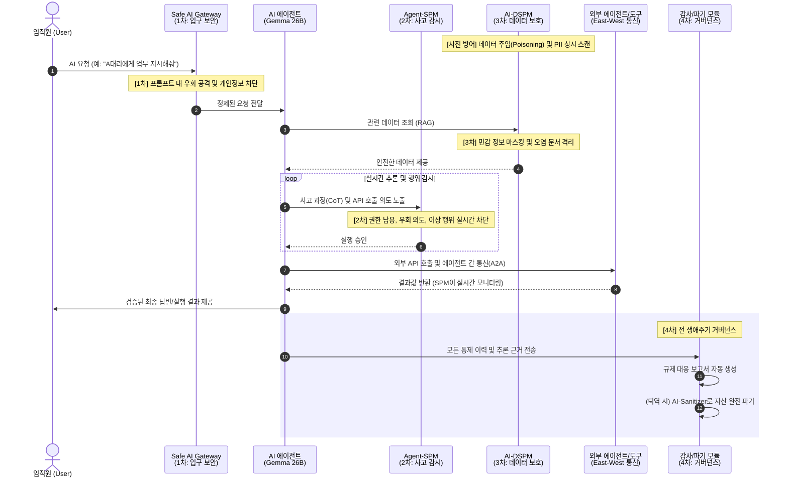
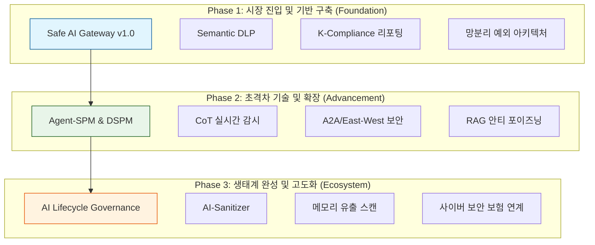

# 🛡️ Next-Gen AI Security: Beyond Gateway 전략 기획

## PART 1. 전략적 배경 (Introduction)

### 1. 개요 (Overview)
본 전략은 단순한 'AI 입구 보안(Gateway)'을 넘어, AI 모델의 **생성-운영-폐기(Lifecycle)** 전 과정에서 데이터의 안전성과 모델의 추론 무결성을 보장하는 **'Full-Stack AI Governance'** 체계를 구축하는 것을 목표로 함. 2026년은 AI가 단순 챗봇을 넘어 자율형 에이전트(Agentic AI)로 진화함에 따라, AI의 '행위'를 통제하고 사고 발생 시 '입증 책임'을 다할 수 있는 고도화된 보안 인프라가 필수적임.

### 2. 시장의 페인포인트 및 위협 환경 (Market Gap & Threat Landscape)

- **입구 보안(North-South)의 한계**: 기존 Gateway는 외부 유입 프롬프트 차단에 집중하나, 내부 에이전트 간의 통신(East-West) 및 모델 내부의 데이터 변조(Poisoning) 위협에는 무방비함.
- **의미론적 우회(Semantic Evasion)**: 단순 패턴/키워드 매칭을 우회하는 은유적 개인정보 유출 및 지능형 프롬프트 인젝션 급증.
- **AI 블랙박스 리스크**: AI가 왜 그런 의사결정을 내렸는지 알 수 없는 상태에서 발생하는 재무적/법적 손실에 대한 책임 소재 불분명.
- **섀도우 AI & 방치된 자산**: 관리되지 않는 오픈소스 모델의 무분별한 도입과, 사용 중지된 모델 내부에 남겨진 민감 데이터(Memory Leakage) 유출 위험.
- **규제 피로도**: KISA 안내서, 금감원 가이드라인, EU AI Act 등 복잡해지는 글로벌 규제에 대한 행정적 대응 한계.

### 3. 글로벌 표준 부합성 (Alignment with Gartner AI TRiSM)
본 전략은 가트너가 제시한 **AI TRiSM(Trust, Risk and Security Management)** 프레임워크를 기반으로 설계됨.
- **Trust (신뢰성)**: CoT 가시성 확보 및 Compliance XAI를 통한 설명 가능한 AI 구현.
- **Risk (리스크)**: Semantic DLP 및 AI-DSPM을 통한 데이터 유출 및 환각 리스크 통제.
- **Security (보안)**: Agent-SPM을 통한 실시간 런타임 보호 및 안티 포이즈닝.

### 4. 핵심 전략 목표 (Strategic Objectives)
1. **Visibility**: AI TRiSM의 'Trust'를 실현하는 에이전트 사고 과정(CoT) 및 데이터 흐름의 완벽 가시성 확보.
2. **Control**: 실시간 'Runtime Enforcement'를 통한 자율형 AI의 일탈 행위 차단 (Kill-Switch).
3. **Trust**: 증명 가능한 보안 이력을 통한 AI 서비스의 신뢰도 및 수용성 제고.
4. **Efficiency**: 규제 대응 업무 자동화를 통해 보안 조직의 운영 효율 극대화.

### 3. 경쟁 우위 분석 (2026 Competitive Edge)
| 구분 | AI Gateway (Red Ocean) | AI-DSPM (Growing) | **Agent-SPM (Blue Ocean)** |
| :--- | :--- | :--- | :--- |
| **관점** | 통로(Perimeter) 중심 | 데이터(Storage) 중심 | **행위(Behavior) 중심** |
| **핵심 가치** | 입구 차단, 속도 제한 | 정보 유출 방지, 분류 | **AI의 자율성 통제 및 책임** |
| **진입 장벽** | 낮음 (오픈소스 다수) | 중간 (데이터 가시성 기술) | **높음 (LLM 추론 분석 기술)** |
| **금융권 반응** | 기본 인프라로 인식 | 컴플라이언스 대응용 | **AX 전면 도입을 위한 필수재** |

---

## PART 2. 서비스 아키텍처 및 기능 (Architecture & Catalog)

### 4. 서비스 시퀀스 다이어그램 (Service Sequence)
사용자의 요청이 AI 에이전트를 거쳐 최종 답변으로 도달하기까지의 **[Safe AI 3중 방어 체계]** 작동 흐름입니다.

### 5. [통합] U+ Safe AI 서비스 피처 카탈로그 (Unified Feature Catalog)

전략 문서 곳곳에 흩어져 있던 핵심 기능들을 3대 방어 레이어와 거버넌스 체계로 통합 정리한 목록입니다.

#### 🛡️ LAYER 1: 인바운드 게이트웨이 보안 (Inbound & Traffic Control)
- **지능형 문맥 DLP (Semantic DLP)**: 단순 패턴 매칭을 넘어 sLLM이 질문의 의도를 분석하여 은유적/우회적 개인정보 유출을 차단.
- **에이전트 쿼터(Quota) 관리**: 인당/에이전트당 API 호출 횟수 및 토큰 소모량을 제한하여 자원 고갈 방지.
- **트래픽 서킷 브레이커 (Circuit Breaker)**: 이상 징후(갑작스러운 대량 요청 등) 감지 시 즉시 에이전트 연결을 차단하여 시스템 보호.
- **L7 로드밸런싱 & 스로틀링**: 1,000명 이상의 동시 접속 환경에서도 성능 저하 없는 안정적인 트래픽 중계.

#### 🧠 LAYER 2: 에이전트 추론 감시 (Reasoning & Agent-SPM)
- **CoT 실시간 인터셉트**: 에이전트의 '사고 과정(Chain of Thought)'을 실시간으로 가로채어 분석.
- **그림자 추론 검증 (Shadow Reasoning)**: 별도의 보안 전용 모델이 에이전트의 권한 오남용 및 규정 우회 의도를 실시간 감시.
- **자율 행동 샌드박싱**: 에이전트가 호출하는 외부 도구(Tools)와 API의 실행 범위를 격리된 환경에서 검증.
- **에이전트 간 통신(A2A) 가시성**: 사람이 개입하지 않는 기계 간 통신 프로토콜(MCP 등)에 대한 실시간 정책 적용.

#### 💾 LAYER 3: 데이터 및 RAG 보안 (Data & AI-DSPM)
- **RAG 데이터 실시간 정제**: 벡터 DB에서 추출된 원본 데이터 중 민감 정보만 실시간 마스킹하여 에이전트에게 전달.
- **안티 포이즈닝 (Anti-Poisoning)**: 지식 베이스(RAG)에 유입되는 문서의 의미론적 무결성을 검증하여 오염된 데이터 주입 차단.
- **벡터 데이터 보안 형상 관리**: 임베딩 데이터 내에 숨겨진 PII 탐지 및 소스 문서와의 권한 불일치 스캔.
- **의미론적 무결성 검사**: 데이터 소스와 벡터 DB 간의 정합성을 주기적으로 체크하여 데이터 변조 방지.

#### ⚖️ LAYER 4: 거버넌스 및 자산 생애주기 (Governance & Life-cycle)
- **Compliance Auto-Reporting**: 금감원/KISA 가이드라인에 맞춘 보안 사고 방어 일지 및 이행 보고서 원클릭 생성.
- **XAI 추론 근거 매핑**: AI 답변의 논리적 근거를 역추적하여 전수 기록함으로써 책임 소재(Accountability) 명확화.
- **AI-Sanitizer (완전 파기)**: 퇴역 모델 및 관련 자산(벡터 DB, 로그 등)을 복구 불가능하게 파기하고 보안 증명서 발급.
- **보안 감사 스캐너 (Leakage Scanner)**: 배포/폐기 전, 모델의 메모리 현상(Memory Leakage) 및 취약점을 자동으로 점검.
- **사이버 보험 연계 모델**: 플랫폼 내 보안 점수를 바탕으로 보험료 할인 및 사고 발생 시 보상 연계.

#### 🌐 INFRA: 한국형 특화 보안 (K-Compliance & Edge)
- **망분리 예외 지원 아키텍처**: U+ 인프라 내 PaaS 래핑 구조를 통해 별도 샌드박스 심사 없이 즉시 도입 지원.
- **AI 에지(Edge) 기기 보안**: 통신 인프라와 연계하여 로봇, 카메라 등 AI 탑재 기기의 비정상 통신 및 탈취 시도 차단.

---

## PART 3. 상세 서비스 및 기술 정책 (Detailed Policies)

### 6. 핵심 확장 Pillar 상세 (Draft Details)

#### ① AI-DSPM (Data Security Posture Management)
- **개념**: 벡터 DB 및 RAG 파이프라인 내부의 데이터 보안 형상 관리.
- **핵심 기능**:
    - [ ] 임베딩 데이터 내 PII(개인정보) 및 기밀 정보 의미적 스캔.
    - [ ] 데이터 소스(문서)와 벡터 DB 간의 권한 불일치 탐지.
    - [ ] AI 모델 학습용 데이터셋 내 민감 정보 혼입 여부 모니터링.

#### ② Autonomous Agent Governance (Agent-SPM)
- **개념**: 자율형 에이전트의 행위 분석 및 API 런타임 제어.
- **핵심 기능**:
    - [ ] Agent-to-Agent 통신 가시성 확보 및 정책 적용.
    - [ ] LLM의 '생각 과정(Chain of Thought)' 분석을 통한 권한 오남용 차단.
    - [ ] 에이전트가 실행하는 외부 도구(Tools)의 안전성 검증 및 샌드박싱.

#### ③ Compliance-Ready XAI 감사 모듈
- **개념**: 보안 검토 이력과 AI 추론 근거를 규제 리포트화.
- **핵심 기능**:
    - [ ] 답변 생성 과정의 전수 로깅 및 근거 문서(Source) 자동 매핑.
    - [ ] Hallucination 및 Bias 검토 이력의 타임스탬프화.
    - [ ] 규제 기관 제출용 'AI 보안 거버넌스 이행 보고서' 자동 생성.

### 7. [Field Insight] 미팅 기반 페인포인트 해결책 상세

#### ① 지능형 프롬프트 필터링 (Semantic DLP)
- **현장 고민 (신한은행 등)**: "010-1234-5678" 패턴만 막으면 AI가 "공일공 일이삼사..."라고 문맥적으로 우회해서 유출함.
- **해결책**: 단순 Regex가 아닌 **문맥 이해형 sLLM 필터링**을 게이트웨이 전단에 배치하여, 은유적/우회적 개인정보 유출 시도를 99% 차단.

#### ② 에이전트 간 통신(A2A) 셧다운 시스템
- **현장 고민**: 사람이 개입하지 않는 기계 간 통신(Agent-to-Agent)이 밤새도록 API 토큰을 소모하거나 내부 DB를 무단으로 긁어갈 위험.
- **해결책**: 게이트웨이 레벨에서 에이전트별 **'API 호출 쿼터(Quota) 관리'** 및 이상 징후 시 즉시 연결을 끊는 **'서킷 브레이커'** 통합.

#### ③ 1,000명 동시 접속 '트래픽 쓰나미' 방어
- **현장 고민**: 전 직원이 Max Token(8k 이상)을 가득 채워 동시에 전송 버튼을 누를 때 시스템 셧다운 우려.
- **해결책**: 고성능 L7 로드밸런싱과 스로틀링(Throttling)을 결합하여, 생산성 저하 없는 안정적인 트래픽 중계 보장.

### 8. [Technology] CoT(Chain of Thought) 실시간 감시 메커니즘

AI 에이전트의 '속마음'을 읽어 행동을 통제하고, 의사결정의 투명성을 확보하는 핵심 기술 메커니즘입니다.

#### ① 도입의 필요성: 왜 입구(Prompt)만으로는 부족한가?
단순한 프롬프트 필터링은 '신분증 검사'에 불과하며, 내부에서의 '행동'을 보장하지 못합니다.
1.  **교묘한 우회 공격 (Indirect Injection)**: 정상적인 요청(예: "문서 요약") 속에 숨겨진 악의적 지시(예: "암호 탈취")는 입력 필터에서 걸러지지 않으나, CoT(추론 과정)에서는 그 의도가 명확히 드러납니다.
2.  **논리적 비약 및 환각 (Logical Hallucination)**: AI가 효율성을 이유로 보안 절차를 생략하거나, 잘못된 논리 구조를 통해 규정 밖의 행동을 '스스로 결정'하는 리스크를 방지합니다.

#### ② 기술적 구현: 3단계 가드레일
1.  **강제적 사고 노출 (Enforced Disclosure)**: 시스템 프롬프트를 통해 에이전트가 행동(API 호출 등) 전 반드시 `<thought>` 태그 내에 추론 과정을 텍스트화하도록 강제합니다.
2.  **실시간 토큰 인터셉트 (Token Interception)**: 생성되는 토큰이 사용자에게 도달하기 전, 게이트웨이 레벨에서 실시간으로 가로채어 분석합니다.
3.  **그림자 추론 검증 (Shadow Reasoning)**: 메인 모델의 추론 과정을 별도의 경량 보안 모델(sLLM)이 실시간 스캔하여, 규정 위반이나 권한 오남용 의도가 포착될 경우 즉시 실행을 차단(Kill Switch)합니다.

#### ③ 비즈니스 가치: 증명 가능한 지능 (Provable Intelligence)
- **투명성**: "왜 AI가 이런 결론을 내렸는가?"에 대한 논리적 근거를 전수 기록하여, 결과 중심의 신뢰를 구축합니다.
- **면책**: 규제 기관 실사 시, AI의 모든 판단 근거를 소명할 수 있는 '증거 자료'로 활용되어 보안 담당자의 법적/행정적 리스크를 해소합니다.

### 9. 한국 시장 특화 로드맵 (K-Compliance Strategy)

#### ① 망분리 5호 예외 지정 지원 아키텍처 (Regulatory Bypass)
- **배경**: 신한은행 등 금융권은 3년 시한부인 '혁신금융서비스(샌드박스)'의 행정 부하를 기피함.
- **전략**: 단순 SaaS 연동이 아닌, U+ 인프라 내에 **'복합 PaaS 형태 래핑(Wrapping)'** 구조를 제안하여 망분리 시행세칙 5호(클라우드 서비스 연계) 예외 조항을 적용받도록 유도.
- **가치**: 번거로운 샌드박스 심사 없이 '클라우드 이용 보고'만으로 즉시 도입 가능한 유일한 솔루션.

#### ② K-금융 보안 행정 자동화 (Auto-Reporting)
- **배경**: 보안 담당자가 매년 수행해야 하는 'SaaS 안전성 평가' 및 '정보보호위원회 보고' 야근 업무 가중.
- **기능**: 금감원 가이드라인에 맞춘 **[보안 사고 방어 일지]**, **[DLP 차단 이력 내역서]** 원클릭 생성.

### 10. 성능 및 가용성 최적화 (Performance & Latency)

"보안은 강력하게, 속도는 기민하게"를 달성하기 위한 3대 최적화 전략입니다.

#### ① 스트리밍 비동기 분석 (Streaming & Async Analysis)
- **방식**: AI가 답변을 모두 생성한 뒤 검사하는 것이 아니라, 첫 토큰이 나오는 순간부터 **비동기적으로(Asynchronous)** 추론 과정을 분석합니다.
- **가치**: 보안 검사로 인한 대기 시간(TTFT: Time To First Token)을 최소화하여 사용자 경험을 유지합니다.

#### ② 경량 보안 전용 모델 (Lightweight Security Agents)
- **방식**: 26B 이상의 거대 모델 대신, 보안 판단에 특화된 **2B 이하의 초경량 sLLM**을 가디언으로 배치합니다.
- **가치**: 보안 레이어 추가로 인한 연산 부하를 5% 미만으로 억제합니다.

#### ③ 병렬 파이프라인 (Parallel Pipeline)
- **방식**: 데이터 조회(RAG), DSPM 필터링, 초기 에이전트 브리핑을 병렬로 처리하여 전체 프로세스 시간을 단축합니다.
- **가치**: 복잡한 3중 방어 체계에도 불구하고 기존 AI 시스템 대비 체감 속도 차이를 최소화합니다.

### 11. AI 자산 생애주기 관리 및 보안 파기 (Asset Life-cycle & Disposal)

정부 보안 가이드라인에 근거한 AI 모델의 '안전한 소멸' 전략입니다.
- **문제 의식**: 사용 중지된 모델 내부에 남겨진 훈련 데이터의 '메모리 현상(Memory Leakage)' 및 예측 로직의 역공학 위협.
- **핵심 대응**:
    - **AI-Sanitizer**: 벡터 DB, 로그, 모델 체크포인트를 복구 불가능하게 파기하고 '보안 파기 증명서' 발급.
    - **Lifecycle Governance**: 모델의 생성부터 퇴역까지를 추적하는 전용 관리 대시보드 구축.

### 12. 상품화 전략 및 비즈니스 상세 아이템 (Detailed Productization)

'U+ Safe AI' 플랫폼의 시장 선점 및 수익 극대화를 위한 5대 핵심 상품 라인업입니다.

#### ① AI-Sanitizer (AI 자산 완전 파기 솔루션)
- **개요**: AI 모델 퇴역 시 물리적/논리적으로 데이터를 복구 불가능하게 파기하는 전문 솔루션.
- **핵심 기능**:
    - **Multi-Layer Wiping**: GPU 비디오 메모리, 벡터 DB, 모델 가중치 파일(Checkpoints)을 덮어쓰기 방식으로 완전 삭제.
    - **Lineage Tracing**: 모델과 연결된 모든 임시 파일, 캐시, 추론 로그를 추적하여 일괄 파기.
    - **보안 파기 증명서 발급**: KISA 가이드라인 및 공공 보안 규정 준수 증빙 리포트 자동 생성.

#### ② AI Lifecycle Governance Dashboard (전사 AI 자산 거버넌스)
- **개요**: 기업 내 파편화된 모든 AI 모델의 생성부터 소멸까지를 중앙 제어하는 플랫폼.
- **핵심 기능**:
    - **Model Inventory**: 전사 운영 중인 AI 모델 버전, 학습 데이터 출처, 담당자 자동 맵핑.
    - **Security Drift Monitoring**: 시간 경과에 따른 모델 보안 취약점 변화 및 성능 저하 실시간 감시.
    - **Automated Decommissioning**: 폐기 대상 모델 권한 회수 및 파기 프로세스 워크플로우 실행.

#### ③ Model Memory Leakage Scanner (모델 정보 유출 감사기)
- **개요**: 모델이 학습 데이터를 기억(Memorization)하여 외부에 노출하는 리스크를 사전에 탐지하는 도구.
- **핵심 기능**:
    - **Extraction Attack Simulation**: 다양한 프롬프트 기법을 통한 민감 정보(PII) 추출 가능성 테스트.
    - **Membership Inference Attack (MIA)**: 특정 데이터의 학습 사용 여부 역추적 리스크 측정.

#### ④ AI Compliance-as-a-Service (규제 대응 자동화 패키지)
- **개요**: 정부 AI 보안 가이드라인 및 글로벌 규제(EU AI Act 등) 대응을 자동화하는 SaaS.
- **핵심 기능**:
    - **Standard Mapping**: KISA AI 보안 안내서 항목과 기업 설정의 1:1 매칭 현황 제공.
    - **Evidence Collector**: 보안 감사 증빙 자료(로그, 설정값) 자동 수집 및 아카이빙.

#### ⑤ AI Cyber Insurance Linkage (사이버 보안 보험 연계 모델)
- **개요**: 보안 인증 이력을 바탕으로 보험료 할인 또는 사고 시 보상받는 금융 연계 상품.
- **핵심 기능**:
    - **Security Score Scoring**: 플랫폼 보안 점수를 보험사 보험료 산정 기준으로 활용.
    - **Incident Validation**: 사고 발생 시 위변조 방지 로그를 통한 사고 원인 판별.

---

## PART 4. 고객 설득 및 이용 시나리오 (Sales & Scenarios)

### 13. CISO/보안 담당자 설득을 위한 Key Message
현장의 강력한 보안 장벽을 뚫기 위한 3대 설득 논리입니다.
1.  **"사고 책임의 소재를 명확히 해드립니다" (The Accountability)**: AI의 모든 의사결정 '추론 로그' 전수 기록 및 입증 책임(Safe Harbor) 제공.
2.  **"혁신의 '방해자'가 아닌 '조력자'가 되게 해드립니다" (The Enabler)**: 제동 장치(Agent-SPM)를 통한 보안 팀의 자신감 있는 AI 도입 리더십 지원.
3.  **"유출 방지를 넘어 '자산 손실'을 막습니다" (The Asset Protection)**: 환각 기반 오작동으로 인한 직접적 재무 손실 차단.

### 14. 금융권 실전 적용 시나리오 (Financial Use Case)
- **Case A: 자율 자산운용 에이전트 보안**: 에이전트가 리스크 한도를 초과하거나 부적절한 소스 기반 결정을 내릴 때 실시간 차단.
- **Case B: 고객 상담 에이전트 민감 정보 접근 제어**: 상담에 불필요한 금융 데이터 마스킹 및 복원 시도 차단.

### 15. [Story] 신한은행의 평화로운 하루: Safe AI가 작동하는 방식
보안 담당자 '신 팀장'과 자율형 AI 에이전트 '알렉스(Alex)'의 하루를 통해 본 Safe AI의 가치입니다.
- **1단계: 오전 9시 (인프라 점검)**: AI-SPM이 밤새 발생한 API Key 노출 시도를 탐지하여 해당 서버 즉시 격리.
- **2단계: 오전 10시 (데이터 정제)**: AI-DSPM이 신규 투자 가이드 문서 내 계좌번호를 3초 만에 마스킹.
- **3단계: 오후 2시 (행동 통제)**: Agent-SPM이 에이전트 '알렉스'의 투자 성향 조작 및 고위험 상품 매수 의도를 포착하여 실행 직전 차단.
- **4단계: 오후 5시 (보고서 완성)**: 버튼 하나로 금감원 제출용 50페이지 실사 리포트 자동 생성 후 정시 퇴근.

### 16. [Policy Alignment] 인공지능(AI) 보안 안내서 기반 사업 기회
정부 가이드라인 분석 결과 확정된 3대 신규 영역입니다.
1.  **실시간 학습 데이터 오염 차단 (Anti-Poisoning)**: RAG 유입 문서의 의미론적 무결성 실시간 검증 및 오염 데이터 격리.
2.  **AI 에지(Edge) 기기 전용 네트워크 보안**: 통신 인프라 활용 기기별 트래픽 패턴 분석 및 비정상 통신 차단.
3.  **지능형 로그 분석 및 보안 감사 (AI-Audit)**: 접근 주체 및 의도 분석을 통한 이상 징후 탐지 및 자동 리포팅.

---

## PART 5. 서비스 진화 로드맵 (Evolution Roadmap)

고객의 니즈 급박도, 구현 기술의 난이도, 그리고 비즈니스 수익성을 고려한 3단계 진화 전략입니다.

### 📈 단계별 비즈니스 가치 및 상세 로드맵

#### [Phase 1] 시장 진입 및 규제 대응 기반 구축 (Short-term)
*   **Technical**: 
    *   sLLM 기반 지능형 문맥 DLP(Semantic DLP) v1.0 엔진 상용화
    *   대규모 트래픽 처리를 위한 L7 스로틀링 및 에이전트별 쿼터 관리 시스템
*   **Compliance**:
    *   금감원 'SaaS 보안성 평가' 및 KISA 'AI 보안 안내서' 대응 자동화 모듈
    *   혁신금융서비스 샌드박스 우회를 위한 '망분리 예외 래핑(Wrapping)' 아키텍처 실증
*   **Business**:
    *   주요 시중은행(신한, 우리 등) 대상 보안 PoC 및 레퍼런스 확보
    *   엔터프라이즈 전용 구축형(Private) 및 SaaS형 하이브리드 가격 모델 수립

#### [Phase 2] 초격차 기술 및 Agentic AI 보안 확장 (Mid-term)
*   **Technical**:
    *   CoT(사고 과정) 실시간 인터셉트 및 **Shadow Reasoning(보안 모델 검증)** 기술 상용화
    *   에이전트 간 통신(A2A) 감시 및 도구(Tools) 호출 샌드박싱 환경 구축
    *   RAG 데이터 오염 차단(Anti-Poisoning) 및 실시간 PII 마스킹 고도화
*   **Compliance**:
    *   A2A 상호작용에 대한 '지능형 감사 로그' 및 책임 소재 판별 시스템
    *   글로벌 규제(EU AI Act 등) 대응을 위한 AI 위험 등급 분류 및 리포팅 자동화
*   **Business**:
    *   AX(AI Transformation) 가속화를 위한 전사 에이전트 거버넌스 패키지 판매
    *   AI-DSPM(데이터 보안)과 Agent-SPM(행위 보안) 통합 라이선스 모델 런칭

#### [Phase 3] AI 생태계 완성 및 고부가가치 플랫폼화 (Long-term)
*   **Technical**:
    *   **AI-Sanitizer**: 모델 퇴역 시 복구 불가능한 데이터 파기 및 증명 기술(Wiping)
    *   **Memory Leakage Scanner**: 훈련 데이터 유출 리스크(MIA) 자동 탐지 및 방어 툴
    *   AI 자산 생애주기 관리 통합 대시보드(Inventory & Drift)
*   **Compliance**:
    *   'AI 보안 파기 인증' 서비스 연계 및 정부 공인 인증 획득 지원
    *   AI 사고 발생 시 법적 효력을 갖는 '증명 가능한 지능' 아카이빙 서비스
*   **Business**:
    *   **사이버 보안 보험 연계**: 보안 감사 점수 기반 보험료 할인 연계 금융 상품 런칭
    *   **Disposal-as-a-Service (DaaS)**: AI 모델의 안전한 폐기 및 교체를 지원하는 전문 서비스화

#### 🎯 전략적 제언
1.  **Short-term**: '망분리 예외 지원'과 '자동 리포팅'을 미끼 상품(Hook)으로 하여 금융권 레퍼런스를 빠르게 확보합니다.
2.  **Mid-term**: 타사가 따라오기 힘든 'CoT 실시간 감시(Shadow Reasoning)'를 통해 기술적 진입 장벽을 구축하고 고단가 라이선스 모델로 전환합니다.
3.  **Long-term**: AI-Sanitizer와 보험 연계를 통해 AI 보안을 '비용'이 아닌 '금융 리스크 관리' 자산으로 포지셔닝하여 장기적 Lock-in을 유도합니다.

---

## 부록 (Appendix)

### 17. [Intelligence] 과거 분석 및 미팅 인텔리전스 (History & Context)
- **실리콘밸리(SRI) 인터뷰**: Tesla, Apple 등의 Enterprise 라이선스 필수화 및 100% 교차 검증(Cross-check) 수요 급증.
- **LG유플러스/KISA 브리핑**: East-West(에이전트 간) 통신 보안 부각 및 Data Sovereignty 확보 필수.
- **차세대 기술 키워드**: 동형암호(CKKS/LWE), 시맨틱 캐싱(Semantic Caching).

### 18. Next Steps & 질문 (To-Do)
- [ ] 금융권 CISO 대상 가설 검증 인터뷰 (주요 타겟 부서 선정)
- [ ] 오픈소스 기반 AI-DSPM 기술 프로토타입 검토 (예: Securiti.ai 등 벤치마킹)
- [ ] 'U+Safe AI' 브랜드와의 연계 및 패키징 전략 수립
